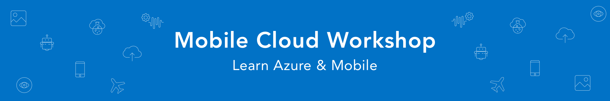

# App Innovation Workshop

Welcome to the Microsoft App Innovation Workshop. We've created this workshop to showcase the speed and ease at which you can leverage Microsoft's cloud platform to build data-driven intelligent apps. The workshop will give you insights and **hands-on labs** on how to leverage innovative scalable Cloud Backend Services for your applications.

#### Who is it for?

Although you can go and explore the content and walkthrough by yourself, the richer learning experience is attending a session led by us. So let's see, if we can schedule something!

[Get in contact](https://mobilecloudworkshop.slack.com)

&nbsp;

## Key Technologies

<table>
  <tr>
    <td nowrap><a href="https://azure.microsoft.com/en-us/services/app-service/">App Service</a></td>
    <td rowspan="12"></td>
  </tr>
  <tr>
    <td nowrap><a href="https://azure.microsoft.com/en-us/services/cosmos-db/">Cosmos DB</a></td>
  </tr>
  <tr>
    <td nowrap><a href="https://azure.microsoft.com/en-us/services/api-management/">API Management</a></td>
  </tr>
  <tr>
    <td nowrap><a href="https://azure.microsoft.com/en-us/services/storage/">Azure Storage</a></td>
  </tr>
  <tr>
    <td nowrap><a href="https://azure.microsoft.com/en-us/services/functions/">Azure Functions</a></td>
  </tr>
  <tr>
    <td nowrap><a href="https://azure.microsoft.com/en-us/services/search/">Azure Search</a></td>
  </tr>
  <tr>
    <td nowrap><a href="https://azure.microsoft.com/en-us/services/cognitive-services/">Cognitive Services</a></td>
  </tr>
  <tr>
    <td nowrap><a href="https://azure.microsoft.com/en-us/services/bot-service/">Bot Service</a></td>
  </tr>
  <tr>
    <td nowrap><a href="https://dev.azure.com/">Azure DevOps</a></td>
  </tr>
  <tr>
    <td nowrap><a href="https://appcenter.ms/">App Center</a></td>
  </tr>
  <tr>
    <td nowrap><a href="https://azure.microsoft.com/en-us/services/active-directory-b2c/">Active Directory</a></td>
  </tr>
  <tr>
    <td nowrap><a href="https://www.xamarin.com/forms/">Xamarin.Forms</a></td>
  </tr>
</table>

##### Build Status

| iOS  | Android |
|:---:|:---:|
|  |  |

&nbsp;

## Guided Walkthrough

You can find a walkthrough guide for the project that outlines how you too can build and deploy your own version of the app and backend services. 

> **Hint:** We highly recommend you setup and configure your system *before* attending one of the guided sessions. Although we’ve allowed an hour in the morning to assist in trouble shooting configurations, we won’t have time to do a fresh installation.

### [1. Setup](Walkthrough%20Guide/01%20Setup/)
### [2. Architecture Options](Walkthrough%20Guide/02%20Architecture%20Options)
### [3. Web API & App Services](Walkthrough%20Guide/03%20Web%20API)
### [4. Data Storage](Walkthrough%20Guide/04%20Data%20Storage)
### [5. Search](Walkthrough%20Guide/05%20Search)
### [6. Functions & Cognitive Services](Walkthrough%20Guide/06%20Functions%20and%20Cognitive%20Services)
### [7. API Management](Walkthrough%20Guide/07%20API%20Management)
### [8. Mobile App Overview](Walkthrough%20Guide/08%20Mobile%20Overview)
### [9. Mobile Network Services](Walkthrough%20Guide/09%20Mobile%20Network%20Services)
### [10. Chatbot](Walkthrough%20Guide/10%20Chatbot)
### [11. Authentication](Walkthrough%20Guide/11%20Authentication)
### [12. Analytics](Walkthrough%20Guide/12%20Anayltics/README.md)

&nbsp;

## Support

**Where to find help**

* Create GitHub issues and we'll respond as quickly as possible 
* Ping us on [Slack](https://mobilecloudworkshop.slack.com)

&nbsp;

## Authors

|               |      |
|:----------------------------------------------:|:--------------------------------------------:|
|                 **Mike James**                 |            **Robin-Manuel Thiel**            |
|  [GitHub](https://github.com/MikeCodesDotNet)  | [GitHub](https://github.com/MikeCodesDotNet) |
| [Twitter](https://twitter.com/MikeCodesDotNet) | [Twitter](https://twitter.com/robinmanuelt)  |
|          [Blog](https://mikecodes.net)         |         [Blog](https://pumpingco.de/)        |

### Contributors

- **Richard Erwin** ([GitHub](https://github.com/rerwinx))
- **Mohamed Saif** ([GitHub](https://github.com/mohamedsaif))
- **Michael Sivers** ([GitHub](https://github.com/msivers))
- **Simona Tarantola** ([LinkedIn](https://www.linkedin.com/in/simona-tarantola-a654917/))
- **Jim Paine** ([GitHub](https://github.com/JimPaine))

## Contributing

This project welcomes contributions and suggestions.  Most contributions require you to agree to a
Contributor License Agreement (CLA) declaring that you have the right to, and actually do, grant us
the rights to use your contribution. For details, visit https://cla.microsoft.com.

When you submit a pull request, a CLA-bot will automatically determine whether you need to provide
a CLA and decorate the PR appropriately (e.g., label, comment). Simply follow the instructions
provided by the bot. You will only need to do this once across all repos using our CLA.

This project has adopted the [Microsoft Open Source Code of Conduct](https://opensource.microsoft.com/codeofconduct/).
For more information see the [Code of Conduct FAQ](https://opensource.microsoft.com/codeofconduct/faq/) or
contact [opencode@microsoft.com](mailto:opencode@microsoft.com) with any additional questions or comments.

