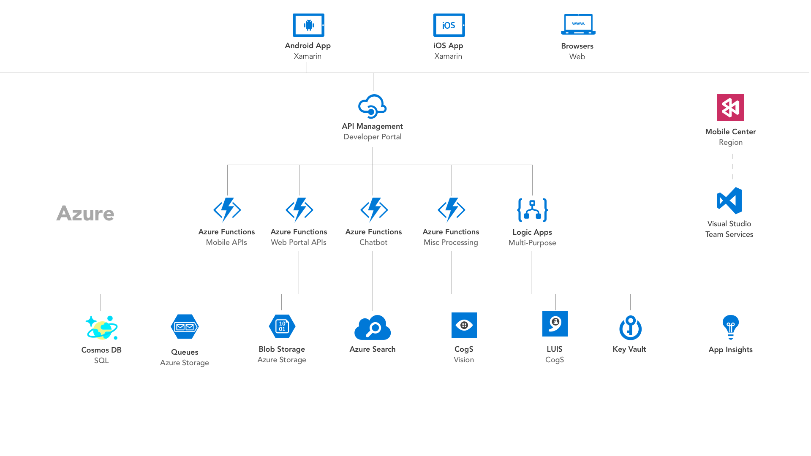
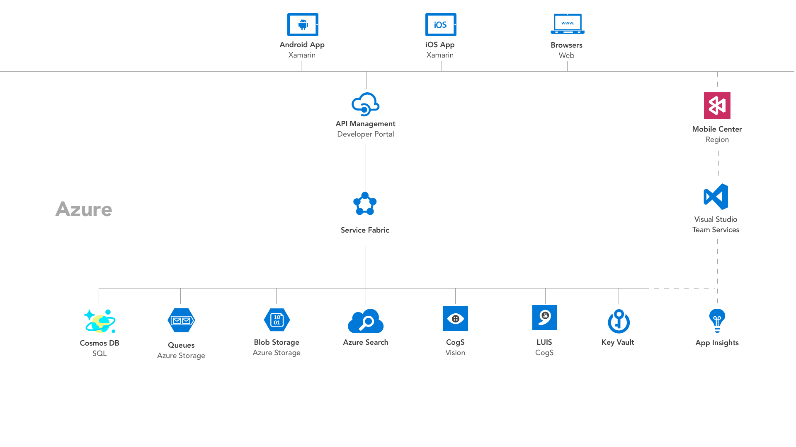

# 1. Architecture Options 
Deciding how to architect a solution isn't an easy task and depending on who you ask, you'll likely get very different answers. There are many different ways we could design such a system and we'll cover a few of them below. 

We're looking for a solution that allows us lots of flexibility with minimal maintenance.  We're interested in focusing on the business problem rather than deploying and maintaining a set of virtual machines. 

It's for the reason that we'll opt to use Platform as a Service (PaaS) as much as possible within our design. 
 

## The real architecture

Above you can see a high-level overview of our production architecture. Some key decisions: 

### Orchestration 
We were going to leverage our .NET skills and build a ASP.NET Web API targetting .NET Core, we've lots of flexibility on where and how to host the code. 

We picked Azure App Service as it supports great IDE integration for both Visual Studio PC and Visual Studio Mac, as well as offering all the PaaS goodness we need to focus on other parts of the solution.  

### Security
As we're not going to implement Authentication in today's workshop, we decided to add API Management to add an additional security layer through the use of API keys. 

### Data Storage 
We've opted for a NoSQL approach using CosmosDB. Our reasoning for this is based on a few reasons. An important part is the geo-replication features of CosmosDB make it a natural choice for new projects, but secondly, our deadline meant we didn't have time to spend migrating database for small model changes (something we did a lot in the beginning). 

---

## Azure Functions

We can swap out the orchestration service from App Service to Azure Functions if we're looking to cut costs and move to a 'serverless' architecture. 

The truth is, there is a server. Azure Functions actually runs in the same environment as App Services, but the way we as developers interact with the service is a little different. 

The biggest difference is how we scale. With Azure Functions, we do not ever have to worry about scaling our services to meet demand. Azure Functions runs on what we call "dynamic compute", in that Microsoft will scale up, down, out and in instances of your code to meet demand. 

We will be developing a version of the backend that is entirely Azure Functions based on the future. 

---
## Micro-Services

Mr. Michael Sivers is currently investigating adding a Micro-Services architecture as a branch. 

If you're interested in helping, then please reach out to us! 

Learn more about [Service Fabric](https://azure.microsoft.com/en-us/services/service-fabric/)
