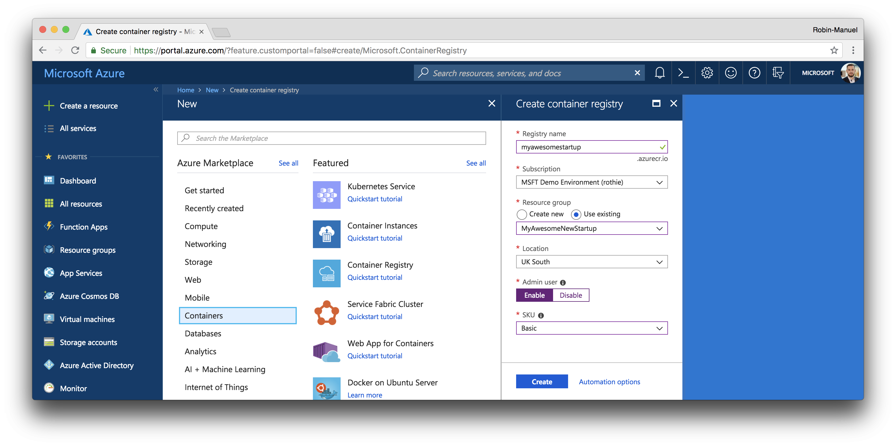
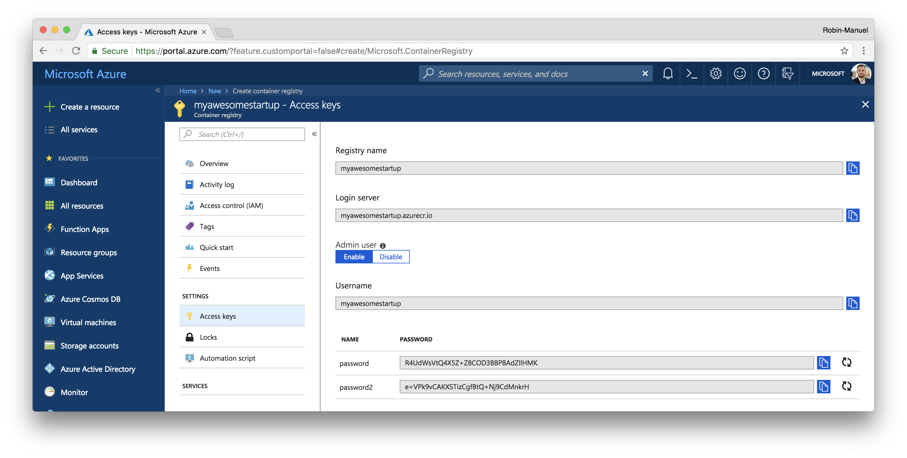
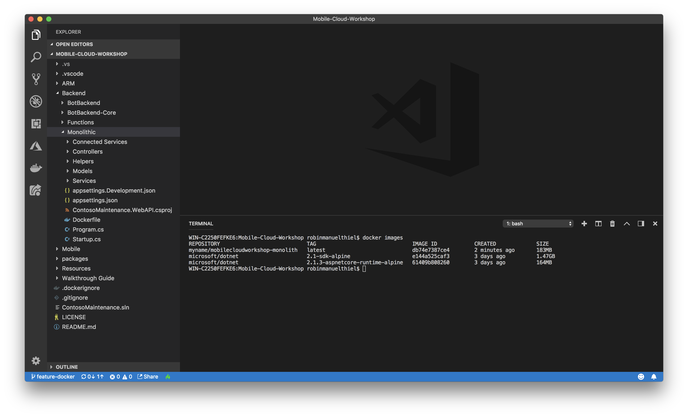

# Deploy Web API

## 1. Resource Group

Before we can deploy any service instances, we need to create a resource group to hold our services. Resource groups can be thought of as logical folders for your Azure Services (Resources). You may wish to create separate resource groups per department, or you may want to have one resource group per project. Resource groups are great for grouping all the services associated with a solution together. During development, it means you can quickly delete all the resources in one operation!

In this workshop, we will be using one resource group to manage all of our required services. When in production, it means we can see how much the services are costing us and how the resources are being used.

### 1.1 Create a new Resource Group


Navigate to the [portal.azure.com](portal.azure.com) and sign in with your credentials.

1. Click ***Resource groups*** in the top-left corner.
2. Click ***Add*** to bring up configuration pane.
3. Supply configuration data. Keep in mind its difficult to change resource group names later.
4. Click ***Create*** and relax.

Navigate to the newly created Resource Group.


And we are done. Now we can start to add services to our newly created Resource Group!

## 2. Code packages or Docker containers

When it comes to deploying our applications to the infrastructure that we will create in the next minutes, we have a few options.

1. Deploy as code packages
2. Deploy as Docker containers

> **Important:** If you want to work with **Kubernetes** or **Service Fabric Mesh**, you have to use containers. App Services support both ways. The choice is up to you, just make sure you are prepared and have the [right tools installed](../01%20Setup). We got both options covered in that workshop.

### 2.1 Code packages

You don't want to work with Docker containers? Fine, but then you have to compile the code and publish it to the Azure Services on your own. No worries, we got you covered. You will find a detailed step-by-step guide in the next section. But you can stop reading here, as we will go over the container part for the rest of this module.

### 2.2 Docker containers

You want to work with containers? Great! You can work with the ones we have prepared for you. You will find them on DockerHub:

- [`robinmanuelthiel/contosomaintenance-api`](https://cloud.docker.com/u/robinmanuelthiel/repository/docker/robinmanuelthiel/contosomaintenance-api)
- [`robinmanuelthiel/contosomaintenance-bot`](https://cloud.docker.com/u/robinmanuelthiel/repository/docker/robinmanuelthiel/contosomaintenance-bot)
- [`robinmanuelthiel/contosomaintenance-functions`](https://cloud.docker.com/u/robinmanuelthiel/repository/docker/robinmanuelthiel/contosomaintenance-functions)

In a real-world scenario, you would probably use your own private Container Registry instead of Docker Hub and build the containers on your own. In Azure you can create you own Container Registry within a few steps. Just open the block below to get some detailed instructions on how to create such a registry, build Docker images on your own and push these to the cloud.

<details><summary>Create your own Azure Container Registry and Docker images</summary><p>

To work with Docker images, you usually need a container registry to upload your containers to, so that cloud services can pull them from there. You can use the popular [Docker Hub](https://azure.microsoft.com/services/container-registry/), but Azure offers its own Azure Container Registry as well.



To create a new registry, open the [Azure Portal](https://portal.azure.com), click ***Create a resource***, ***Containers***, ***Container Registry*** and configure it like this:

- **Registry Name:** `myawesomestartup` (or similar)
- **Subscription:** *choose the one you created earlier*
- **Resource group:** *choose the one you created earlier*
- **Location:** *same as your App Service*
- **Admin user:** Enable
- **SKU:** Basic

Click the ***Create*** button and wait until your Container Registry got provisioned.

In the ***Keys*** section of your Container Registry, you will find important information, like **Registry Name**, **Login Server**, **Username** and **Password**, that you will need to tag and upload a Docker image to it.



In your Command Line, run the following command, to log into your freshly created Container Registry. Make sure, to replace `myawesomestartup.azurecr.io` with your **Login Server**.

```bash
docker login myawesomestartup.azurecr.io -u <username> -p <password>
```

To "containerize" the Backend code, you can use the [`Dockerfile`](../Backend/Monolithic/Dockerfile), that comes with the ASP.NET Core project in the `Backend/Monolithic` folder of the workshop. It describes everything Docker needs, to create an image out of it.

Right-click the `Monolithic` folder in Visual Studio Code and select ***Open in Terminal / Command Line***. The Terminal window in Visual Studio Code pops up and we can enter the command to build the docker image.

```bash
docker image build -t myawesomestartup.azurecr.io/contosomaintenance/api:latest .
```

That triggers the creation process of the Docker image, based on the Dockerfile in the repository. During that process, the official [.NET Core SDK Docker Image](https://hub.docker.com/r/microsoft/dotnet/) gets downloaded from Dockerhub and the code will be compiled in there. To verify, that the image got created successfully, you can list all images on your machine with the following command.

```bash
docker images
```

The output should contain your image.



Now we can push the image do our Azure Container Registry with the following command.

```bash
docker push myawesomestartup.azurecr.io/contosomaintenance/api
```

</p></details>

## 3. Create the compute layer with App Services or Container Orchestrators

Now we can finally start with the creation of the compute layer for our backend architecture. As already mentioned, we have some options there. We covered the following ones in this workshop from which you can choose.

> **Hint:** Your choice will only affect the compute layer. All other services like databases and storage will be the exact same regardless of your decision here.

### [Azure App Services](01%20App%20Service/)

### [Azure Kubernetes Service (AKS)](02%20Kubernetes/)
