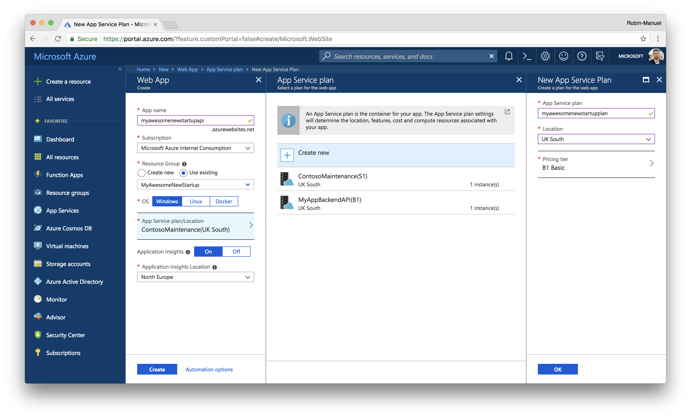
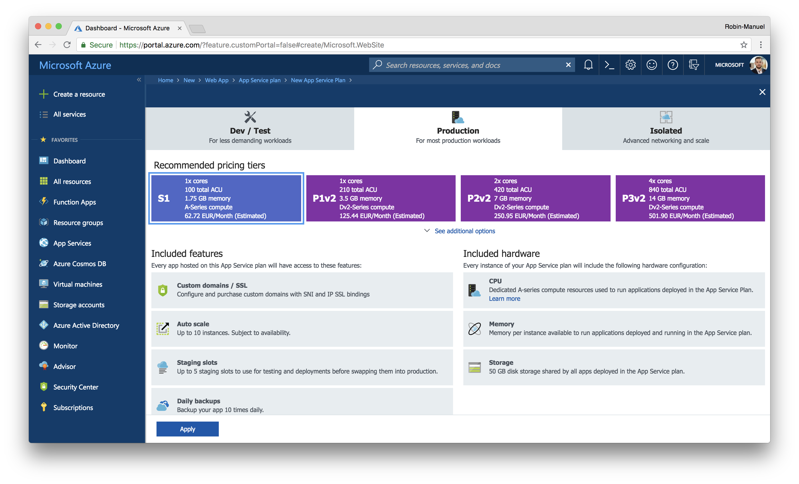
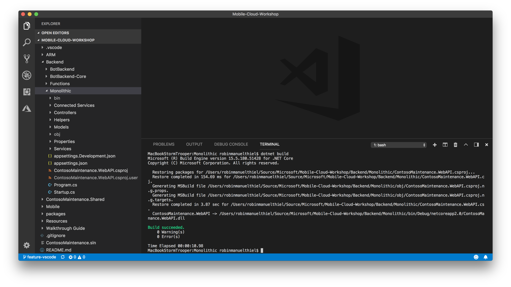

# App Service

Azure App Service is Microsoft’s fully managed, highly scalable platform for hosting web, mobile and API apps built using .NET, Java, Ruby, Node.js, PHP, and Python or Docker containers.

App Service is fully managed and allows us to set the maximum number of instances on which we want to run our backend app on. Microsoft will then manage the scaling and load balancing across multiple instances to ensure your app perform well under heavy load. Microsoft manages the underlying compute infrastructure required to run our code, as well as patching and updating the OS and Frameworks when required.

## 1. Resource Group

Before we can deploy an App Service instance, we need to create a resource group to hold today's services. Resource groups can be thought of as logical folders for your Azure Services (Resources). You may wish to create separate resource groups per department, or you may want to have one resource group per project. Resource groups are great for grouping all the services associated with a solution together. During development, it means you can quickly delete all the resources in one operation!

In this workshop, we’ll be deploying just one resource group to manage all of our required services. When in production, it means we can see how much the services are costing us and how the resources are being used.

### 1.1 Create a new Resource Group


Navigate to the [portal.azure.com](portal.azure.com) and sign in with your credentials.

1. Click ***Resource groups*** in the top-left corner.
2. Click ***Add*** to bring up configuration pane.
3. Supply configuration data. Keep in mind its difficult to change resource group names later.
4. Click ***Create*** and relax.

Navigate to the newly created Resource Group.


And voilà, we are done. Now we can start to add services to our newly created Resource Group!

## 2. Create a new App Service (Web App)

Web Apps are one of the App Services, that we can deploy to Azure. They can be configured easily at the [Azure Portal](https://portal.azure.com). You can find them, by clicking the ***Create a resource*** button at the top-left corner and selecting the ***Web*** category.


### 2.1 Configure your App Service

As you can see in the configuration blade, we have to configure a few things, before creating a new App Service, as App Name, Subscription, Resource Group, OS and App Service Plan / Location. Let's go through all of them in detail quickly, to understand, what we are configuring here.

#### App name

This is the name of your application and as you can see, the name will resolve into an web address like `yourname.azurewebsites.net`. After creation of your App Service, it weill be publically available at this address. Of course, you can also assign a custom domain to it later.

#### Subscription

By the end of the day, someone has to pay for all these services, that we are provisioning. Behind every Azure Subscription is a payment model that takes care of our cost. One Azure Account can have multiple Subscriptions.

#### Resource Group

We have learned about the concept of Resource Groups earlier in this module. During the creation process of every Azure Resource, we can select a Resource Group, to assign it to.

#### OS

App Services, can be based on Windows, Linux or Docker as their core technology. This becomes important, when taking a look at the programming framework, that we are using for the application's logic itself. While .NET Framework for example only runs on Windows, Node.js is more performant on a Linux host. If we want to provide a Docker container instead of deploying our application directly to the App Service, we can do that as well.

> **Hint:** At this workshop, the Backend API Logic is written with .NET Core, which runs cross-platform. So you can choose both, Windows and Linux. We also provide it as a Docker image, so you can also choose Docker as the operation system of your App Service. Just choose, whatever you are most interested in!

#### App Service Plan

An App Service, is just the logical instance of an application, so it has to run within an **App Service Plan**, which is provides the actual hardware for it. You can run multiple App Services within the same App Service Plan, if you want to, but be aware, that they share the App Service Plan's Resources then. We will create an App Service Plan step by step in the following sections of this module.

### 2.2 Create an App Service Plan

In App Service, an app runs in an App Service plan. The App Service plan defines a set of compute resources for a web app to run. These compute resources are analogous to the server farm in conventional web hosting. One or more apps can be configured to run on the same computing resources (or in the same App Service plan). When you create an App Service plan in a certain region (for example, West Europe), a set of compute resources is created for that plan in that region. Whatever apps you put into this App Service plan run on these compute resources as defined by your App Service plan.

To create a new App Service Plan for our Web App, click the ***App Service Plan/Location*** button in the Web App Create wizard **AFTER YOU HAVE SELECTED AN OS** and click on the ***Create new*** button.



Fill in the following values:

- **App Service plan:** `myawesomestartupplan` (or similar)
- **Location:** *Choose a location near your customers*
- **Pricing tier:** B1

Creating an App Service Plan is easy, but we have to consider where our users are? We want our services to be running as close to our users as possible as this dramatically increases performance. We also need to consider how much Compute resources we think we'll need to meet demand.

Clicking ***Pricing Tier***, shows all the different options we have (it's a lot!). I won't list what their differences are as their listed in the portal, but keep it mind, with the cloud we don't need to default to over-provisioning. We can scale up later if we have to! For this workshop, a B1 Basic site will be more than enough to run this project. More complex development projects should use something in the Standard range of pricing plans. Production apps should be set up in Standard or Premium pricing plans.



The pricing tier and with it the size of your App Service can be changed later, when you need to scale-up the service. Once you have configured your app service plan, click ***Ok***.

After you configured everything, the App Service Plan configuration should now look like this:

- **App name:** `myawesomestartupapi` (or similar)
- **Resource group:** *choose the one you created earlier*
- **OS:** Windows, Linus or Docker
- **App Service plan/Location:** *choose the one you created earlier*
- **Application Insights:** On
- **Application Insights Location:** *choose the closest one*

With all the configuration options set, hit "Create" and hold tight. Once the deployment has finished, we should be able to navigate to our app through the browser and see a generic Azure landing page. The deployment of the new service can take a few minutes, but you can watch its progress in the "Bell" notification area in the toolbar. 

Because my app name was: "myawesomestartupapi", the unique URL would be: `https://myawesomestartupapi.azurewebsites.net`. You should see something similar to the image below, when browsing it.


## 3. Deploy your apps to App Service

Azure App Service has many options for how to deploy our code. These include continuous integration, which can link to Visual Studio Team Services or GitHub. We could also use FTP to upload the project, but we're not animals, so we won't - let's use Visual Studio Code for that.

The good news is: The full ASP.NET Core WebAPI code for the backend logic is already written for us and is located in the `Backend/Monolithic` folder of the workshop. But before we can upload it to the cloud, we need to **compile** it to make it machine readable, or create a Docker image for it. We will go through both options during this module.

### 3.1 Compile or containerize the application

#### Option 1: Compiling the code by yourself

We quickly have to dive into the .NET Developer's world! For this, right-click the `Monolithic` folder in Visual Studio Code and select ***Open in Terminal / Command Line***. The Terminal window in Visual Studio Code pops up and we can enter the command to compile the application.

```bash
dotnet build
```

The output should look like this and we should see the **Build succeeded** message.



Building (compiling) the code generated two more folders for us: `/bin` and `/obj`. Here we can find executable files that we can upload to the web. As an ASP.NET Core project does not only consist of .NET code, but also contains some HTML, CSS and JavaScript, we need to bundle all the files together. So let's run another command.

```bash
dotnet publish
```

Once this command ran successfully, we have everything we need. Inside our `Monolithic` folder, we should now find a `bin/Debug/netcoreapp2.0/publish` folder that contains our ready-to-run backend logic. Now you can simply right-click this `publish` folder and select ***Deploy to Web App***.


Follow the process of selecting a Subscription and Web App to publish to, confirm the publish process and enjoy your Web API.

#### Option 2: Create and use a Docker image

If you want to "containerize" the code, you can use the [`Dockerfile`](../Backend/Monolithic/Dockerfile), that comes with the ASP.NET Core project in the `Backend/Monolithic` folder of the workshop. It describes everything Docker needs, to create an image out of it.

Right-click the `Monolithic` folder in Visual Studio Code and select ***Open in Terminal / Command Line***. The Terminal window in Visual Studio Code pops up and we can enter the command to compile the application.

```bash
docker image build -t yourname/contosomaintenance-monolith:latest .
```

That triggers the creation process of the Docker image, based on the Dockerfile in the repository. During that process, the offical [.NET Core SDK Docker Image](https://hub.docker.com/r/microsoft/dotnet/) gets downloaded from Dockerhub and the code will be compiled in there. To verify, that the image got created successfully, you can list all images on your machine with the following command.

```bash
docker images
```

The output should contain your image.


To deploy that image into your App Service now, you need to publish it to a Container Registry (like Dockerhub or Azure Container Registry), sothat your App Service can pull it from there. For the ease of use, we will use an [image, that we have already published](https://hub.docker.com/r/robinmanuelthiel/contosomaintenance-api/) for you now. But if you are interested, on how to publish your own image, you can read detials about that here: [Push images to Docker Cloud](https://docs.docker.com/docker-cloud/builds/push-images/).

Now open the [Azure Portal](https://portal.azure.com) and navigate to your Docker based App Service, that you have created earlier. When you scroll down to the ***Container Settings*** on the left side, you can find a configuration for public images from Docker Hub. Here we can enter the name of our (or your own) image like [`robinmanuelthiel/contosomaintenance-api`](https://hub.docker.com/r/robinmanuelthiel/contosomaintenance-api/) and ***Save*** the settings.


### 3.2 Verify, your app is running

After a few seconds, after refreshing the browser, your Web App should display the published code and look like this:


To test if the deployment is work and the app is accepting HTTP requests correctly, let's go ahead and navigate to the **/api/ping** endpoint. In my case, I'll use the following URL: `http://myawesomestartupapi.azurewebsites.net/api/ping`.


This shows that the backend is responding as expected! Before we move onto deploying storage services, you might want to read some tips and tricks for running App Services like a pro.

## Next Steps
[Data Storage](../04%20Data%20Storage/README.md)

&nbsp;
&nbsp;
&nbsp;

---

&nbsp;
&nbsp;
&nbsp;


# Tips & Tricks
You've now deployed your first App Service instance! We'll now review some 'Pro tips' to help you get the most out of your Azure service. 

## Controlling Density 
Most users will have a low number (usually less than 10) applications per App Service Plan. In scenarios where you expect you'll be running many more applications, it's crucial to prevent over-saturating the underlying compute capacity. 

Let's imagine that we've deployed one instance of our admin web portal and two instances of our mobile web API to the same App Service Plan. By default, all apps contained in a given App Service Plan will run on all the available compute resources (servers) allocated. If we only have a single server in our App Service Plan, we'll find that this single server will run all our available apps. Alternatively, if we scale out the App Service Plan to run on two servers, we'll run all our applications (3 apps) on both sets of servers. 

This approach is absolutely fine if you find that your apps are using approximately the same amount of compute resources. If this isn't the case, then you may find that one app is consuming the lions share of compute resources, thus degrading the entire system performance. In our case, the mobile API will likely drive significant consumption of server resources, so we need to mitigate its effects on the performance of the admin portal. 

To do this, what we can do is move lower-volume applications (such as the portal) into a single App Service Plan running on a single compute resource. 

Place high demand apps into an App Service Plan which is configured to auto-scale based on CPU and memory utilisation. 

## Per-App Scaling 
Another alternative for running large numbers of applications more efficiently is to use the per-app scaling feature of Azure App Service. We've [documententation](https://msdn.microsoft.com/en-us/magazine/mt793270.aspx) that covers per-app scaling in detail. Per-App scaling lets you control the maximum number of servers allocated to a given application, and you can do so per application. In this case, an application will run on the defined maximum number of servers and not on all available servers.

## Application Slots
App Service has a feature called [deployment slots](https://docs.microsoft.com/en-gb/azure/app-service/web-sites-staged-publishing). In a nutshell, a deployment slot enables you to have another application (slot) other than your production app. It’s another application that you can use to test new code before swapping into production.

Application slots are among the most used feature in App Service. However, it’s important to understand that each application slot is also an application in its own right. This means application slots can have custom domains associated with them, different SSL certificates, different application settings and so on. It also means the assignment of an application slot to an App Service Plan can be managed separately from the App Service Plan associated with the main production slot.

By default, each application slot is created in the same App Service Plan as the production slot. For low-volume applications, and/or applications with low CPU/memory utilization, this approach is fine.

However, because all applications in an App Service Plan run on the same servers, this means by default all of an Application’s Slots are running on the same underlying server as production. This can lead to problems such as CPU or memory constraints if you decide to run stress tests against non-production slots, which run on the same server as your production application slot.

If resource competition is scoped just to scenarios such as running load tests, then temporarily moving a slot to a different App Service Plan, with its own set of servers, will do the following:

* Create additional App Service Plan for the non-production slots. Important note: Each App Service Plan needs to be in the same resource group and the same region as the production slot’s App Service Plan.
* Move a non-production slot to a different App Service Plan and, thus, a separate pool of compute resources.
* Carry out resource-intensive (or risky) tasks while running in the separate App Service Plan. For example, load tests can be run against a non-production slot without negatively impacting the production slot because there won’t be any resource contention.
* When the non-production slot is ready to be swapped into production, move it back to the same App Service Plan running the production slot. Then the slot swap operation can be carried out.

## Deploying to Production with no downtime 
You have a successful application running on an App Service Plan, and you have a great team to make updates to your application on a daily basis. In this case, you don’t want to deploy bits directly into production. You want to control the deployment and minimize downtime. For that, you can use your application slots. Set your deployment to the “pre-production” slot, which can be configured with production setting, and deploy your latest code. You can now safely test your app. Once you’re satisfied, you can swap the new bits into production. The swap operation doesn’t restart your application, and in return, the Controller notifies the front-end load balancer to redirect traffic to the latest slots.

Some applications need to warm up before they can safely handle production load—for example, if your application needs to load data into cache, or for a .NET application to allow the .NET runtime to JIT your assemblies. In this case, you’ll also want to use application slots to warm up your application before swapping it into production.

We often see customers having a pre-production slot that’s used to both test and warm up the application. You can use Continuous Deployment tools such as Visual Studio Release Manager to set up a pipeline for your code to get deployed into pre-production slots, run test for verification and warm all required paths in your app before swapping it into production.

## Public Virtual IPs
By default, there’s a single public VIP for all inbound HTTP traffic. Any app is addressable to a single VIP. If you have an app on App Service, try running nslookup command and see the result. Here’s an example:

```
» nslookup myawesomestartupapi.azurewebsites.net 
Server:        2001:4898::1050:1050
Address:    2001:4898::1050:1050#53

Non-authoritative answer:
myawesomestartupapi.azurewebsites.net    canonical name = waws-prod-ln1-013.vip.azurewebsites.windows.net.
waws-prod-ln1-013.vip.azurewebsites.windows.net    canonical name = waws-prod-ln1-013.cloudapp.net.
Name:    waws-prod-ln1-013.cloudapp.net
Address: 51.140.59.233
```

You’ll notice that an App Service scale unit is deployed on Azure Cloud Service (by the cloudapp.net suffix). WAWS stands for Windows Azure (when Azure was still called Windows) Web sites (the original name of App Service).

## Outbound Virtual IPs
Most likely your application is connected to other Azure and non-Azure services. As such, your application makes outbound network calls to endpoints, not on the scale unit of your application. This includes calling out to Azure services such as SQL Database and Azure Storage. There are up to five VIPs (the one public VIP and four outbound dedicated VIPs) used for outbound communication. You can’t choose which VIP your app uses, and all outbound calls from all apps in scale unit are using the five allocated VIPs. If your application uses a service that requires you to whitelist IPs that are allowed to make API calls into such a service, you’ll need to register all five VIPs of the scale unit. To view which IPs are allocated to outbound VIPs for a given unit of scale (or for your app from your perspective) go to the Azure portal, as shown in the below image. 

 

If you require a dedicated set of inbound and outbound IPs, you should explore using a fully isolated and dedicated App Service Environment. 

## IP And SSL
App Service supports IP-based SSL certificates. When using IP-SSL, App Service allocates to your application a dedicated IP address for only in-bound HTTP traffic.

Unlike the rest of Azure dedicated IP addresses, the IP address with App Service via IP-SSL is allocated as long as you opt to use it. You don’t own the IP address, and when you delete your IP-SSL, you might lose the IP address (as it might be allocated to a different application).

App Service also supports SNI SSL, which doesn’t require a dedicated IP address and is supported by modern browsers. 

## Network Port Capacity for Outbound Network Calls
A common requirement for applications is the ability to make outbound network calls to other network endpoints. This includes calling out to Azure internal services such as SQL Database and Azure Storage. It also includes cases where applications make calls to HTTP/HTTPS API endpoints—for example, calling a Bing Search API or calling an API “application” that implements back-end business logic for a Web application.

In almost all of these cases, the calling app running on Azure App Service is implicitly opening a network socket and making outbound calls to endpoints that are considered “remote” from an Azure Networking perspective. This is an important point because calls made from an app running on Azure App Service to a remote endpoint rely on Azure Networking to set up and manage a table of Network Address Translation (NAT) mappings.

Creating new entries in this NAT mapping takes time, and there’s ultimately a finite limit on the total number of NAT mappings that can be established for a single Azure App Service scale unit. Because of this, App Service enforces limits on the number of outbound connections that can be outstanding at any given point in time.

The maximum connection limits are the following:

* 1,920 connections per B1/S1/P1 instance
* 3,968 connections per B2/S2/P2 instance
* 8,064 connections per B3/S3/P3 instance
* 64K max upper limit per App Service Environment

Applications that “leak” connections invariably run into these connection limits. Applications will start intermittently failing because calls to remote endpoints fail, with the failures sometimes correlating closely to periods of higher application load. You’ll frequently see errors like the following: “An attempt was made to access a socket in a way forbidden by its access permissions aaa.bbb.ccc.ddd.”

The likelihood of running into this problem can be substantially mitigated with a few best practices:

* For .NET applications using ADO.NET/EF, use database connection pooling.
* For .NET applications making outbound HTTP/HTTPS calls, pool and reuse instances of System.Net.Http.HttpClient or use Keep-alive connections with System.Net.HttpWebRequest. 

- Tips and Tricks Source: [MSDN](https://msdn.microsoft.com/en-us/magazine/mt793270.aspx)

---
### Further Reading
* [Offical Documentation](https://docs.microsoft.com/en-us/azure/app-service/)
* [Adding API documentation with Swagger](https://docs.microsoft.com/en-us/aspnet/core/tutorials/web-api-help-pages-using-swagger)
