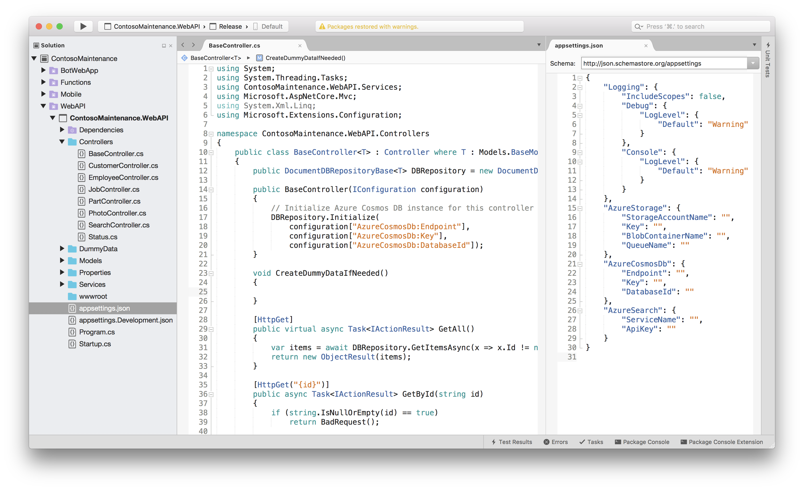
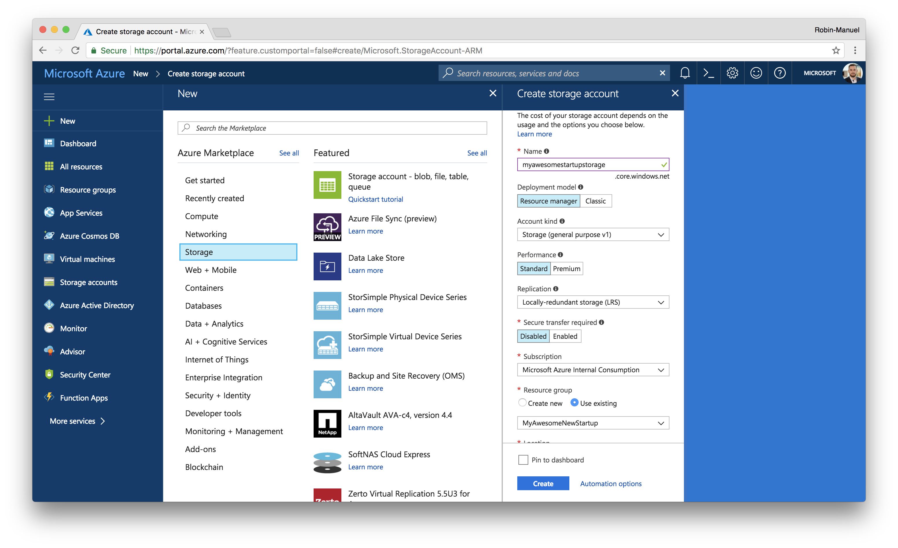
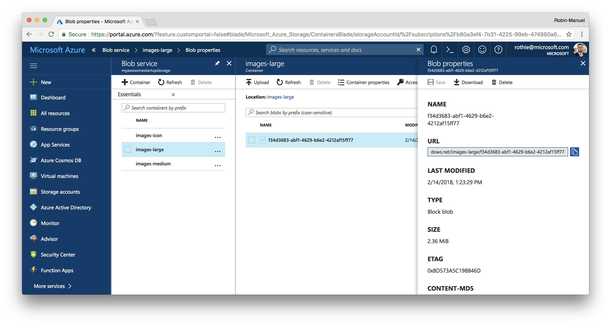

# Data Storage

As we are collecting and displaying different types of information like *Jobs*, *Parts*, *Users* and *photos*, we need to store them somewhere in the cloud. For this, we chose two different types of storages: **Blob Storage** for raw files like images and a **NoSQL Database** for storing unstructured data like Jobs.

## 1. Azure Cosmos DB for unstructured data

Whenever it comes to unstructured data an NoSQL approaches in the Microsoft Azure ecosystem, Cosmos DB should be our database of choice. It is a globally-distributed, multi-model database service which makes it super flexible to use and extremely easy to scale to other regions.

Beside *Disk Space* and *Consistency*, Cosmos DB's main scale dimension is *Throughput*. For each collection, developers can reserve throughput for their data, which ensures the 99.99th percentile of latency for reads to under 10 ms and for writes to under 15 ms. Pre-reserved Throughput which is defined by request units (RUs) is mainly determining the price of a Cosmos DB instance. Fetching of a single 1KB document by id spends roughly 1 RU. You can use the [Cosmos DB capacity planner tool](https://www.documentdb.com/capacityplanner) to calculate, how many RUs your database might need.

### 1.1 Create a Cosmos DB instance

To create a new Cosmos DB instance in the [Azure Portal](https://portal.azure.com), click the ***New*** button in the top-left corner and find ***Azure Cosmos DB*** within the ***Databases*** section.


Choose the following settings and hit the ***Create*** button to start provisioning the Cosmos DB instance.

- **ID:** myawesomenewstartupdb
- **API:** SQL
- **Resouce Group:** Use existing
- **Location:** Same as your Web App
- **Enable geo-redundancy:** No (for now)

### 1.2 Explore Cosmos DB

After a few seconds, Azure should have created the database service and we can start exploring Cosmos DB by navigating to it in the Azure Portal.


#### 1.2.1 Scalability and Consistency

As we can see from the ***Overview*** section, Azure Cosmos DB is all about scalability and availability. We get greeted by a map that shows us, which regions our data gets synchronized to and we can easily add and remove regions by selecting or deselecting them on the map or the ***Replicate data globally section*** in the side menu.

With scaling databases to multiple instances, *Consistency* immediately come to our minds. By default, Cosmos DB uses *Session consistency* but we can choose from five different [Consistency levels](https://docs.microsoft.com/en-us/azure/cosmos-db/consistency-levels) in the ***Default Consistency*** menu, if we feel the need to change that.

> **Hint:** Even when selecting multiple regions for Azure Cosmos DB, the connection string will always stay the same. That's a very nice feature, which allows your backend to not care about the location of your database at all. Cosmos DB has its own traffic manager that will route your query to the fastest location autimatically.

#### 1.2.2 Security Keys

Like every other database, Azure Cosmos DB offers security through access control using Keys. Head over to the ***Keys*** section of the data base to check your keys for different access levels (read-write and read-only) and connection strings. We will need these information later, when we connect the Cosmos DB to the Web API.

#### 1.2.3 Data Explorer

One nice feature of Azure Cosmos DB is the ***Data Explorer*** that can be found in the side menu and offers a live view on the data that sits inside the database. We can also edit and query the documents here.

At the moment our database is empty, but we will come back later to take a look at what's going on here.

### 1.3 Connect Azure Cosmos DB with the Web API

#### 1.3.1 Locate the connection in the Web API code

To let the Web API write data into the database and read or modify documents from it, we need to connect it with our backend logic of course. The code for it has already been written using the [Azure Cosmos DB .NET SDK for SQL](https://docs.microsoft.com/en-us/azure/cosmos-db/sql-api-sdk-dotnet). You can find the backend logic for creating, reading, updating and deleting documents in the [`DocumentDBRepositoryBase.cs`](/Backend/Monolithic/Services/DocumentDBRepositoryBase.cs) class of the Web Api code.



As you might have seen, the connection details to the Cosmos DB are not hard-coded but listed in the [`appsettings.json`](/Backend/Monolithic/appsettings.json) file of the Web Api project. This means, that the application is accessing them at runtime either from its environment variables or from this file.

```json
"AzureCosmosDb": {
    "Endpoint": "",
    "Key": ""
}
```

[View in project](/Backend/Monolithic/appsettings.json#L21-L24)

As these settings are empty, let's set them in the Web API's environment variables!

#### 1.3.2 Add Connection Information to application secrets

Add the following secrets to your application as described in the according Secrets sections for App Services or Kubernetes.

> **Hint:** Here you can find the [App Service Secrets](/Walkthrough%20Guide/03%20Web%20API/01%20App%20Service#use-secrets) and [ Kubernetes Secrets](/Walkthrough%20Guide/03%20Web%20API/02%20Kubernetes#use-secrets) sections.

- **`AzureCosmosDb__Endpoint`:** Uri of the Cosmos DB instance
- **`AzureCosmosDb__Key`:** Primary Key of the Cosmos DB instance

### 1.4 Generate data

#### 1.4.1 Fetch from Cosmos DB for the first time

Once we add the connection information to the App Service Settings, the Web API should be able to connect to the database. We can check that by calling the **Jobs API endpoint** at `/api/job` to fetch a list of all Jobs from the databse.


As we can see, (of course) there are no jobs inside the database at the moment. But we don't get an error message but an empty list. That means, that there is at least "something" inside of our database now. The [`DocumentDBRepositoryBase.cs`](/Backend/Monolithic/Services/DocumentDBRepositoryBase.cs#L97-L138) class creates databases and collections that are not existent automatically when it gets asked for them.

Let's check the Cosmos DB's ***Data Explorer*** at the Azure Portal to see what happened!


As we can see, a `contosomaintenance` database has been created with an empty `jobs` collection. If we click at the ***Scale & Settings*** tap, we can see that the collection has been created with 400 RUs reserved, which is the minimum. Whenever we see more traction on this collection, we can scale up here.

#### 1.4.2 Add a new document manually

Time to add our first job manually! Let's click the ***New Document*** button in the `jobs` collection and add a JSON document like the following one in the editor to add a dummy job that points to the Microsoft headquarter in Redmond.

```json
{
    "id": "3de8f6d0-e1b6-416a-914d-cd13554929a4",
    "Name": "Service ATR 42 Engine",
    "Details": "General Service",
    "Type": "Service",
    "Status": "Waiting",
    "Attachements": null,
    "Address": {
        "point": {
            "type": "Point",
            "coordinates": [
                -122.1517886,
                47.6586067
            ]
        }
    },
    "AssignedTo": null,
    "DueDate": "0001-01-01T00:00:00",
    "createdAt": "2018-01-25T00:34:49.753398+00:00",
    "isDeleted": false
}
```

Once we hit ***Save***, we should be able to return to our API and fetch the list of jobs again. Now, the list should not be empty anymore but contain our new dummy job.


> **Tip:** To get well-formatted JSON in Google Chrome, you can use the [JSONView Plugin](https://chrome.google.com/webstore/detail/jsonview/chklaanhfefbnpoihckbnefhakgolnmc)

#### 1.4.3 Generate Dummy Data

To have actual data in the Cosmos DB instance to play around with and to avoid having you to write a bunch of dummy Jobs and Parts manually, we have prepared some dummy data for this workshop. Once the Cosmos DB connection is configured, you can call the `api/dummy` endpoint of your Web API to fill the database.

[//]: # (Empty line for spacing)
&nbsp;

## 2. Azure Blob Storage for raw files like photos

Now that we can store documents for *Jobs*, *Parts* and other unstructured data in the form of JSON documents, let's add a space to store raw files like pictures. In the **Contoso Maintenance App**, users can take photos and add them to *Jobs* to document damages or process. To store these pictures, we should add **Blob Storage** to our backend infrastructure. 

### 2.1 Create a Storage Account

For that, head over to the [Azure Portal](https://portal.azure.com), click the ***New*** button, open the ***Storage*** category and select ***Storage Account*** to add some cloud storage to store your files at.



Choose the following settings and hit the Create button to start provisioning the Storage Account.

- **ID:** myawesomestartupstorage
- **Deployment model:** Resource manager
- **Account kind:** Storage (general purpose v1)
- **Performance:** Standard
- **Replication:** Locally-redundant storage (LRS)
- **Secure transfer required:** Disabled
- **Resource Group:** Use existing
- **Location:** Same as your Web App

### 2.2 Explore Azure Blob Storage

After a few seconds, Azure provisioned a Storage Account for us and we can navigate to it in the Azure Portal.


#### 2.2.1 Storage Services

Besides Blob Storage, an Azure Storage Account bundles all kinds of storages like Tables, Blobs, Files and Queues. Whenever we need to store data in one of these areas, we can use this Storage Account for that. For now, **Blobs** is the storage type that is most interesting for our image uploads but we will explore at least one more later at this workshop.

#### 2.2.2 Security Keys

Similar to what we saw with Cosmos DB, Azure Storage is also secured with Access Keys to manage control. We will need also these information later, when we connect the Storage Account to the Web API the same way we did with Cosmos DB before.

#### 2.2.3 Configuration

We can upgrade and configure our Storage Account to use Solid State Disks (Premium Storage), only allow encrypted file transfers and replicate it through multiple data centers or regions for additional availablility and performance.

### 2.3 Connect Blob Storage with the Web API

#### 2.3.1 Create Blob containers for photos

Before we connect the dots between the Web API backend and the Storage Account, we should create **Containers** for storing the uploaded photos at. Navigate to the ***Browse blobs*** section in the menu on the left and create a new container using the ***Add Container*** button.


Let's create a container for the uploaded images in their original size with anonymous read access from external.

- **Name:** images-large
- **Public access level:** Blob (anonymous read access for blobs only)

The `images-large` containter will be used by the backend to upload all pictures that have been taken with the device camera to. Later in this workshop, we will down-scale these images automatically for performance enhancements at it is not a best practice to always download full-size images.

So let's also create two more containers for scaled images with the same properties, so that we end up with three containers.

- `images-large` (Blob)
- `images-medium` (Blob)
- `images-icon` (Blob)


#### 2.3.2 Add Storage Queue

Now that we have added Containers for uploaded photos, we use another Storage Type of Azure Storage Accounts: Storage Queues. Those are simple message queues that can handle any kind of information and saves them until they got processed. Although we do not need the Storage Queue for the image upload directly, it will become important later at this workshop and it is a good time to create it now.


Enter the ***Queues*** section of the Storage Account via the side menu and create a new Queue called `processphotos`.

#### 2.3.3 Add Connection Information to Environment Variables

Similar to the Cosmos DB configuration above, the Web API backend project also manages Azure Blob Storage Access through environment variables.

```json
"AzureStorage": {
    "StorageAccountName": "",
    "Key": ""
}
```

[View in project](/Backend/Monolithic/appsettings.json#L15-L20)

Add the following secrets to your application as described in the according Secrets sections for App Services or Kubernetes.

> **Hint:** Here you can find the [App Service Secrets](/Walkthrough%20Guide/03%20Web%20API/01%20App%20Service#use-secrets) and [ Kubernetes Secrets](/Walkthrough%20Guide/03%20Web%20API/02%20Kubernetes#use-secrets) sections.

- **`AzureStorage__StorageAccountName`:** Storage Account name (e.g. myawesomestartupstorage)
- **`AzureStorage__Key`:** Key 1 key from the ***Access Keys*** section

Once this is done, the backend will choose this Storage Account and the  `images-large` blob container to upload photos.

### 2.4 Test the photo upload

Let's test if everything works as expected and send our first photo to the Web API. For this, API Development Tools like [Postman](https://www.getpostman.com/) helps us to send files against network endpoints.

#### 2.4.1 Uploading a photo

The API endpoint for the photo upload is  `/api/photo/{jobId}` and we can basically upload any file we want. You can choose a picture from the web or your computer or use the [Demo-AirplaneAssembly.jpg](Assets/Demo-AirplaneAssembly.jpg) ([Source](https://en.wikipedia.org/wiki/Airplane)) from this repository. Make sure to send the picture as **form-data** file to the API as it expects it in the [`PhotoController.cs`](/Backend/Monolithic/Controllers/PhotoController.cs#L30).

Take the `id` from any job in your Cosmos DB to build the url and attach the photo to a specific *Job*.


You can send the photo via [Postman](https://www.getpostman.com/) with the following settings.

- **Method:** POST
- **Url:** `http://myawesomestartupapi.azurewebsites.net/api/photo/3de8f6d0-e1b6-416a-914d-cd13554929a4` (or similar)
- **Body:** form-data
- **form-data:**
  - **Key:** `file`
  - **Value:** `Demo-AirplaneAssembly.jpg` (or similar)

Hit ***Send*** and check for the response status **200 OK**.

#### 2.4.2 Checking the result

We should now see the uploaded photo in our Blob Storage container `images-large`. So let's navigate to the Storage Account in the Azure Portal and check if it's there by selecting ***Containers*** from the side menu and opening the `images-large` container.



And voilà, here it is. The API replaces the original name by a GUID ([View in project](/Backend/Monolithic/Controllers/PhotoController.cs#L40)) but that's okay as we need to give uploaded photos a unique ID. Congratulations, you data storage works!

# Additional Resouces

- [Modeling Data in Cosmos DB vs. traditional SQL Databases](https://docs.microsoft.com/en-us/azure/cosmos-db/modeling-data)
- [Azure Cosmos DB RU Calculator and capacity planner](https://www.documentdb.com/capacityplanner)

&nbsp;

---
### [Next Step: Functions and Cognitive Services](../06%20Functions%20and%20Cognitive%20Services)
---

&nbsp;
