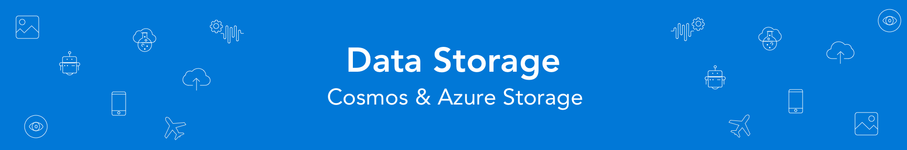
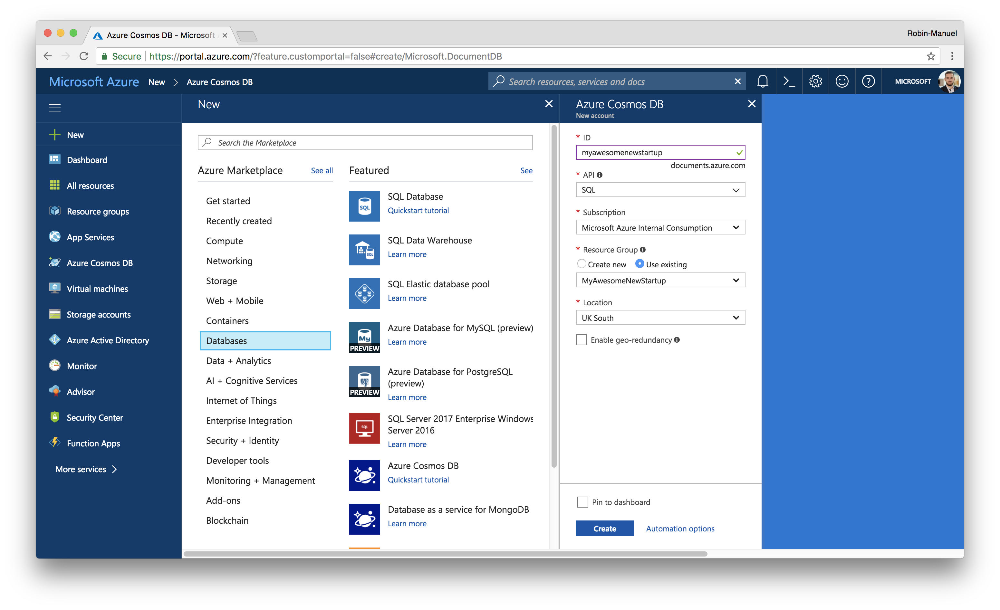
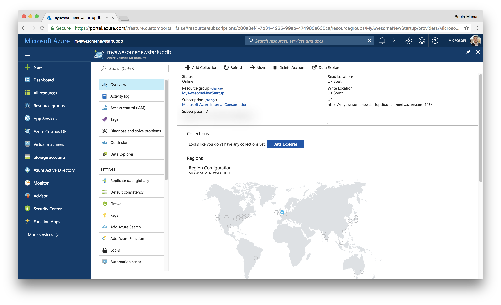

# Data Storage

As we are collecting and displaying different types of information like *Jobs*, *Parts*, *Users* and *photos*, we need to store them somewhere in the cloud. For this, we chose two different types of storages: **Blob Storage** for raw files like images and a **NoSQL Database** for storing unstructured data like Jobs.

## 1. Azure Cosmos DB for unstructured data

Whenever it comes to unstructured data an NoSQL approaches in the Microsoft Azure ecosystem, Cosmos DB should be our database of choice. It is a globally-distributed, multi-model database service which makes it super flexible to use and extremely easy to scale to other regions.

Beside *Disk Space* and *Consistency*, Cosmos DB's main scale dimension is *Throughput*. For each collection, developers can reserve throughput for their data, which ensures the 99.99th percentile of latency for reads to under 10 ms and for writes to under 15 ms. Pre-reserved Throughput which is defined by request units (RUs) is mainly defining the price of a Cosmos DB instance. Fetching of a single 1KB document by id spends roughly 1 RU.

### 1.1 Create a Cosmos DB instance

To create a new Cosmos DB instance in the [Azure Portal](https://portal.azure.com), click the ***New*** button in the top-left corner and find ***Azure Cosmos DB*** within the ***Databases*** section.



Choose the following settings and hit the ***Create*** button to start provisioning the Cosmos DB instance.

- **ID:** myawesomenewstartupdb
- **API:** SQL
- **Resouce Group:** Use existing
- **Location:** Same as your Web App
- **Enable geo-redundancy:** No (for now)

### 1.2 Explore Cosmos DB

After a few seconds, Azure should have created the database service and we can start exploring Cosmos DB by navigating to it in the Azure Portal.



#### 1.2.1 Scalability and Consistency

As we can see from the ***Overview*** section, Azure Cosmos DB is all about scalability and availability. We get greeted by a map that shows us, which regions our data gets synchronized to and we can easily add and remove regions by selecting or deselecting them on the map or the ***Replicate data globally section*** in the side menu.

With scaling databases to multiple instances, *Consistency* immediately come to our minds. By default, Cosmos DB uses *Session consistency* but we can choose from five different [Consistency levels](https://docs.microsoft.com/en-us/azure/cosmos-db/consistency-levels) in the ***Default Consistency*** menu, if we feel the need to change that.

#### 1.2.2 Security Keys

Like every other database, Azure Cosmos DB offers security through access control using Keys. Head over to the ***Keys*** section of the data base to check your keys for different access levels (read-write and read-only) and connection strings. We will need these information later, when we connect the Cosmos DB to the Web API.

#### 1.2.3 Data Explorer

One nice feature of Azure Cosmos DB is the ***Data Explorer*** that can be found in the side menu and offers a live view on the data that sits inside the database. We can also edit and query the documents here.

At the moment our database is empty, but we will come back later to take a look at what's going on here.

### 1.3 Connect Azure Cosmos DB with the Web API

#### 1.3.1 Locate the connection in the Web API code

To let the Web API write data into the database and read or modify documents from it, we need to connect it with our backend logic of course. The code for it has already been written using the [Azure Cosmos DB .NET SDK for SQL](https://docs.microsoft.com/en-us/azure/cosmos-db/sql-api-sdk-dotnet). You can find the backend logic for creating, reading, updating and deleting documents in the [`DocumentDBRepositoryBase.cs`](/Backend/Monolithic/Services/DocumentDBRepositoryBase.cs) class of the Web Api code.


As you might have seen, the connection details to the Cosmos DB are not hard-coded but listed in the [`appsettings.json`](/Backend/Monolithic/appsettings.json) file of the Web Api project. This means, that the application is accessing them at runtime either from its environment variables or from this file.

```json
"AzureCosmosDb": {
    "Endpoint": "",
    "Key": "",
    "DatabaseId": ""
}
```

As these settings are empty, let's set them in the Web Api's environment variables!

#### 1.3.2 Add Connection Information to Environment Variables

Navigate to the Web API App Service in the Azure Portal and open the ***Application settings*** from the menu on the left. Scroll down to the ***Application settings*** section and you will see a table where we can add settings to.


Add the settings in the format `Settings:Key` and take the values from the ***Keys*** section of your Cosmos DB instance.

- **`AzureCosmosDb:Endpoint`:** Uri of the Cosmos DB instance
- **`AzureCosmosDb:Key`:** Primary Key of the Cosmos DB instance
- **`AzureCosmosDb:DatabaseId`:** Any name for a database (e.g. contosomaintenance)

The `DatabaseId` is the top-level domain of the collections that will be used (or generated) by the backend. A single Cosmos DB instance can consist of multiple databases. At the moment, we do not have any databases but the backend code will use this Key to create one.

### 1.4 Generate data

Once we add the connection information to the App Service Settings, the Web API should be able to connect to the database. We can check that by calling the **Jobs API endpoint** at `/api/jobs` to fetch a list of all Jobs from the databse.


As we can see, (of course) there are no jobs inside the database at the moment. But we don't get an error message but an empty list. That means, that there is at least "something" inside of our database now. The [`DocumentDBRepositoryBase.cs`](/Backend/Monolithic/Services/DocumentDBRepositoryBase.cs) class creates databases and collections that are not existant automatically when it gets asked for them.

Let's check the Cosmos DB's ***Data Explorer*** at the Azure Portal to see what happened!


## Further Reading
- Key Vault: https://docs.microsoft.com/en-us/aspnet/core/security/key-vault-configuration?tabs=aspnetcore2x

