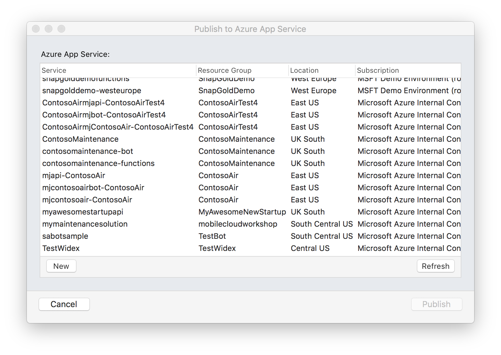
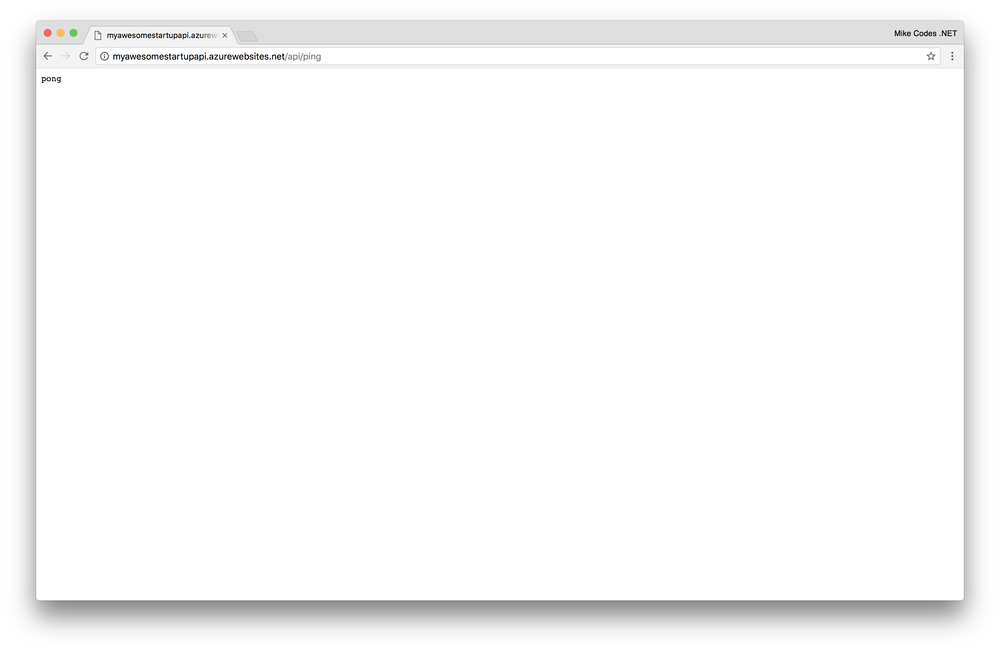

# App Service

Azure App Service is Microsoft’s fully managed, highly scalable platform for hosting web, mobile and API apps built using .NET, Java, Ruby, Node.js, PHP, and Python.

As App Service is fully managed, we only need to worry about setting the maximum number of instances on which we want to run our backend app on. Microsoft will then manage the scaling and load balancing across multiple instances to ensure your app perform well under heavy load. Microsoft manages the underlying compute infrastructure required to run our code, as well as patching and updating the OS and Frameworks when required. 

Before we can deploy an App Service instance, we need to create a resource group to hold today's services. 

### 1.1 Resource Group

Resource groups can be thought of as logical containers for your Azure Resources. You may wish to create separate resource groups per location, or alternatively, you may wish to have one resource group per project.

In this workshop, we’ll be deploying just one resource group to manage all of our required services. 

Resource groups are great for grouping all the resources associated with a mobile application together. During development, it means you can delete all the resources in one operation. For production, it means you can see how much the service is costing you and how the resources are being used.

### 1.2 Create Resource Group

Navigate to the [portal.azure.com](portal.azure.com) and sign in with your MSDN credentials.

1. Click 'Resource Groups' in the top-left corner.
2. Click 'Add' to bring up configuration pane. 
3. Supply configuration data. Keep in mind its difficult to change resource group names later. 
4. Click 'Create' and relax. 

Navigate to the newly created Resource Group.

### 1.3 App Service Plan

#### 1.3.1 Overview 
In App Service, an app runs in an App Service plan. An App Service plan defines a set of compute resources for a web app to run. These compute resources are analogous to the server farm in conventional web hosting. One or more apps can be configured to run on the same computing resources (or in the same App Service plan).

When you create an App Service plan in a certain region (for example, West Europe), a set of compute resources is created for that plan in that region. Whatever apps you put into this App Service plan run on these compute resources as defined by your App Service plan. Each App Service plan defines:

* **Region** (West US, East US, etc.)
* **Number of VM instances**
* **Size of VM instances** (Small, Medium, Large)
* **Pricing tier** (Free, Shared, Basic, Standard, Premium, PremiumV2, Isolated, Consumption)

#### 1.3.2 Create App Service Plan

From within your new Resource Group, do the following: 
* Click "Add" in the top bar. 
* Search for "App Service Plan"

 

 

 The process for creating an App Service Plan is straightforward but you have a couple of decisions to make. The first decision is where is the service going to run. In a production environment, the correct answer would be "near your end user". In development, we'd want our app running "Close to the developers". You'll have lots of options for where to deploy the plan, so give some thought about where most requests will be coming from and pick a location that's as close as possible. 

 

 The second decision you'll have to make is what to run the service on; also known as the Pricing tier. If you Click View all, you will see you have lots of choices. F1 Free and D1 Shared, for example, run on shared resources and are CPU limited. You should avoid these as the service will stop responding when you are over the CPU quota. That leaves Basic, Standard, and Premium. Basic has no automatic scaling and can run up to 3 instances - perfect for development tasks. Standard and Premium both have automatic scaling, automatic backups, and large amounts of storage; they differ in features: the number of sites or instances you can run on them, for example. Finally, there is a number after the plan. This tells you how big the virtual machine is that the plan is running on. The numbers differ by the number of cores and memory.

For our purposes, a B1 Basic site is enough to run this workshop project. More complex development projects should use something in the Standard range of pricing plans. Production apps should be set up in Standard or Premium pricing plans.

Once you have created your app service plan and saved it, Click "Create".

The creation of the service can take a couple of minutes. You can monitor the process of deployment by clicking on the Notifications icon. This is in the top bar on the right-hand side and looks like a Bell. Clicking on a specific notification will provide more information about the activity. 

 
 
### 1.4 Adding an App to our App Service
Right now the App Service Plan doesn't contain any Apps. We will want at least one app for our ASP.NET Core 2.0 Web API service. To create this, let's navigate back to the Resource Group and click "Add" again. This time, we'll be searching for a "Web API". 

 

* Select 'Web App' from the list and click Create. 

 

We'll need to provide a unique app name, which will become part of the URL we use to navigate to the service. We should also select our subscription service and most importantly, we'll want to run this app in the App Service Plan we just deployed. 

Given that we're running our app in Platform as a Service, we don't really need to worry too much about the underlying operating system. With that said, I highly recommend picking Windows as we've thoroughly tested this workshop with that configuration. 

With all the configuration options set, hit "Create" and hold tight. Once the deployment has finished, we should be able to navigate to our app through the browser and see a generic Azure landing page. 

Because my app name was: MyAwesomeStartupAPI
The unique URL would be: https://myawesomestartupapi.azurewebsites.net

You should see something similar to the image below: 

 

### 1.5 Deploy your own apps to App Service
 Azure App Service has many options for how to deploy our code. These include continuous integration, that link to Visual Studio Team Services or GitHub, integrations with cloud storage providers like OneDrive and the venerable but trusty FTP mechanisms. If none of those suit you, you can publish right from Visual Studio. Below you can see how I publish using the built-in Azure integrations in Visual Studio for macOS. You'll find the same is possible in Windows but the UI might be slightly different. 

 
Navigate to **Build** > **Publish** > **Publish to Azure**
 

After the app has been successfully published, you should be taken to the app using your default browser.

We haven't created a user interface so you can expect to see an empty page, not dissimilar to the above. To test if the deployment is work and the app is accepting HTTP requests correctly, let's go ahead and navigate to the **/api/ping** endpoint. In my case, I'll use the following URL: 

http://myawesomestartupapi.azurewebsites.net/api/ping

### Further Reading
* [Tips & Tricks](TipsAndTricks.md)
* [Documentation](https://docs.microsoft.com/en-us/azure/app-service/)