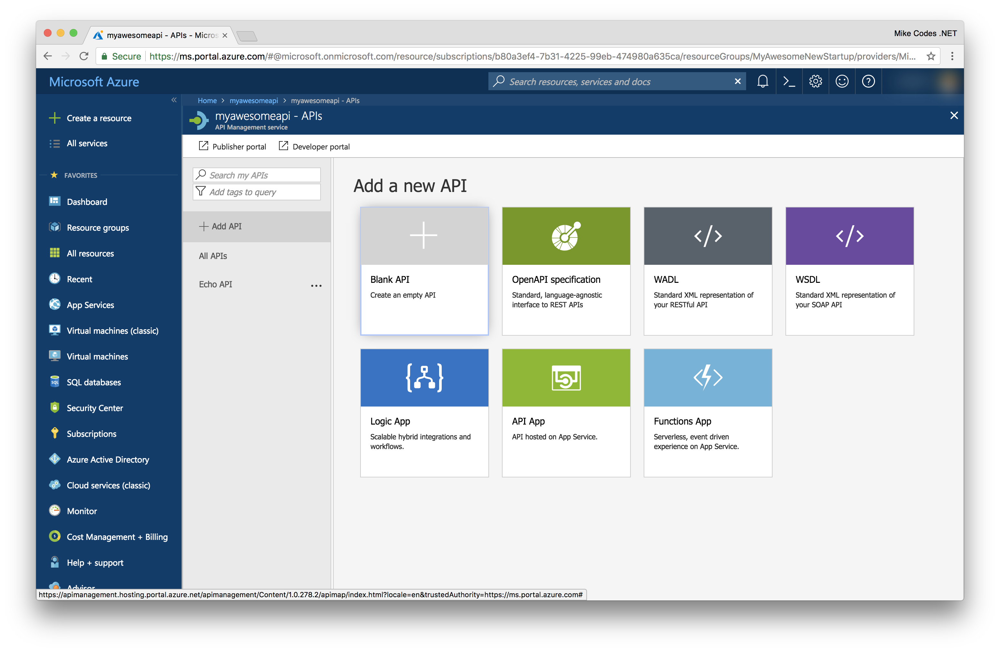
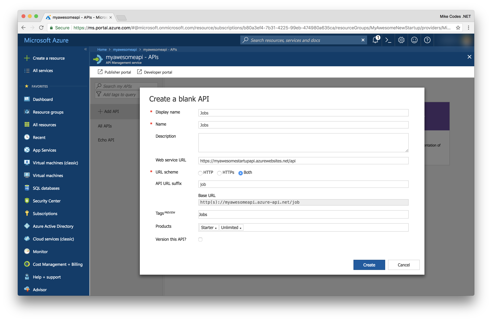
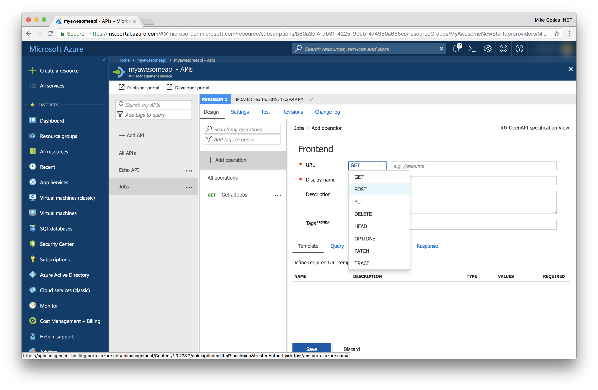
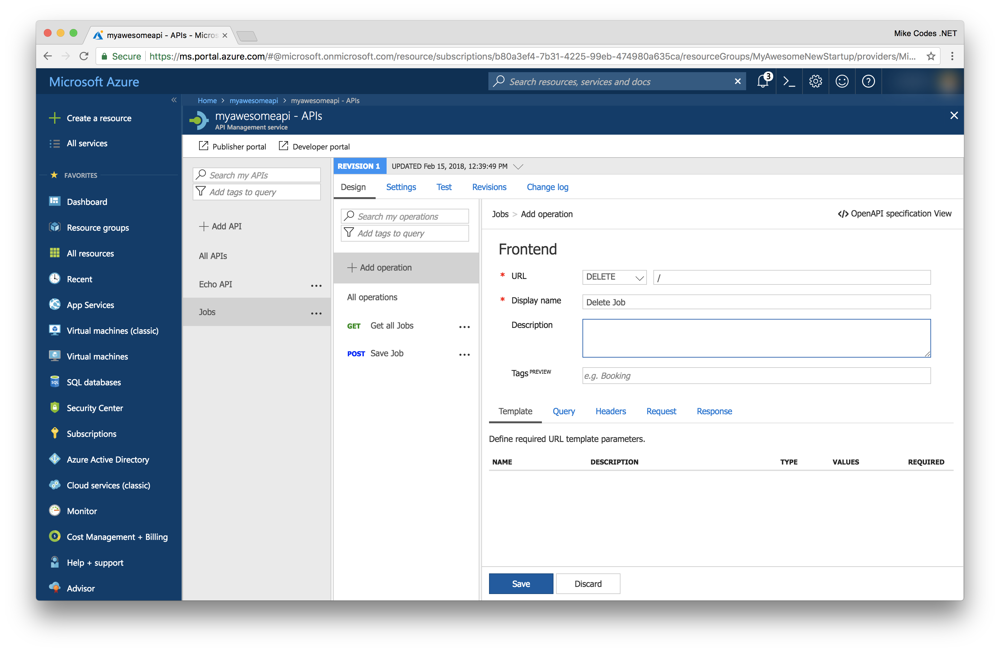

# API Management
Azure API Management is a turnkey solution for publishing APIs for external and internal consumption. It allows for the quick creation of consistent and modern API gateways for existing or new backend services hosted anywhere, enabling security and protection of the APIs from abuse and overuse. We like to think of API Management as businesses digital transformation hub as it empowers organisations to scale developer onboarding as well as monitoring the health of services. 

We'll be using API Management in today's workshop to act as a gateway or barrier between our Azure Resources and our mobile app. 

There are two parts of API Management which consist of the Admin portal and the developer portal. We can use the admin portal to create new APIs and manage access and provide our colleagues and consumers of the APIs access to the developer portal. You can find a our API Management portal running [here](https://contosomaintenance.portal.azure-api.net/)

### Management
* **Subscription Portal:** this is an administrative portal where API programs are configured. It's possible to:
    * Define or import API schemas
    * Package API’s into products
    * Setup policies like quotas or transformations on APIs
    * Get insight from Analytics
    * Manage users

### Traffic 
Azure API Management is available worldwide and ready to scale up and down on demand and without service interruption, handling any traffic growth or spike. Traffic to APIs can also be controlled using with Azure Traffic Manager or Request Throttling. .

## Deploy API Management 
Lets head over to our Resource Group again and hit the "Add" button again. 

Select the "API Management" result. You'll then navigate to the Creation blade. 
    

Choose the following settings and hit the Create button to start provisioning the API Management instance.

* Name: myawesomeneapi
* Resouce Group: Use existing
* Location: Same as your Web App
* Organization Name: The name of your business (it'll appear in the portals). 
* Administrator Email: Set this to yourself
* Pricing Tier: You can select Developer for this workshop. 

API Management can take about 20 minutes to deploy so now might be a good time to take a quick break if you need it. If you wish to monitor the deployment progress, you can click on the right bell icon. 

It's worth checking that the service is active after deployment as this can take a couple more minutes. 

---

## Understanding our usage
We're using API Management as our access layer, routing all HTTP requests to our backend through it. You can see this below in this basic diagram (it's not the entire architecutre, but more of a high-level overview). 

If we imagine the flow for searching jobs. Our request leaves the phone, hits our API Manager, which will route it to the nearest instance of our backend. The backend that takes the request and routes it to the correct contrller, which has the implementation for interacting with Azure Search. 

API Management will need to be configured to route our requests to the correct place, so let's go ahead and start on that. 

## Configuring API Management

For this workshop, we wont need to add anymore products, but you can find a complete guide on the [Azure Documentation](https://docs.microsoft.com/en-us/azure/api-management/api-management-howto-add-products) site that covers this in depth. 

---
### Implementing Operations
We need to define our operations for the API Management. We have already deployed our backend so we should be in a position to hook up to the App Service instance and consume real data. It's worth keeping in mind that its possible to send Mock responses back from API Management, which can help in the development of large solutions. 

#### Jobs
To kick off, we'll start by adding an endpoint to API Manangement for handling access to Jobs. To do this, click on "APIs" on the left hand menu. 

Lets start by creating an API from scratch using the "Blank API" template. 

We can then provide a few details about our API. 

* **Display Name:** This name is displayed in the Developer portal.
* **Name:** Provides a unique name for the API. 
* **Description:** Description of the API
* **Web Service URL:** The URL where we'll be sending these requests. 
* **URL Scheme** Determines which protocols can be used to access the API.
* **API URL Suffix:** The suffix is appended to the base URL for the API management service. API Management distinguishes APIs by their suffix and therefore the suffix must be unique for every API for a given publisher.
* **Tags:** Tags enable the organization of large lists – both in terms of management and presentation on the developer portal.
* **Products:** Publish the API by associating the API with a product. To optionally add this new API to a product, type the product name. This step can be repeated multiple times to add the API to multiple products.
* **Version This API:** Would you like to version the API? 

#### Adding an operation

* **HTTP Verb:** You can choose from one of the predefined HTTP verbs.
* **URL:** A URL path for the API.
* **Display Name:** 
* **Description:** Provide a description of the operation that is used to provide documentation to the developers using this API in the Developer portal.
* **Tags:** Tags enable the organization of large lists – both in terms of management and presentation on the developer portal.

##### Adding operations

**Get**

**Delete**

**Put**

---
# Next Steps 
[Functions & Cognitive Services](../06_Functions_Cognitive_Services/README.md)
