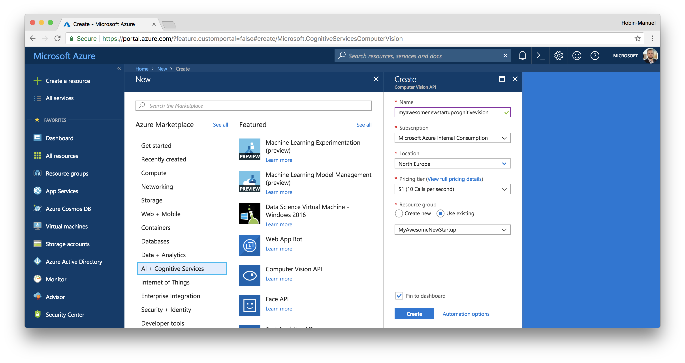
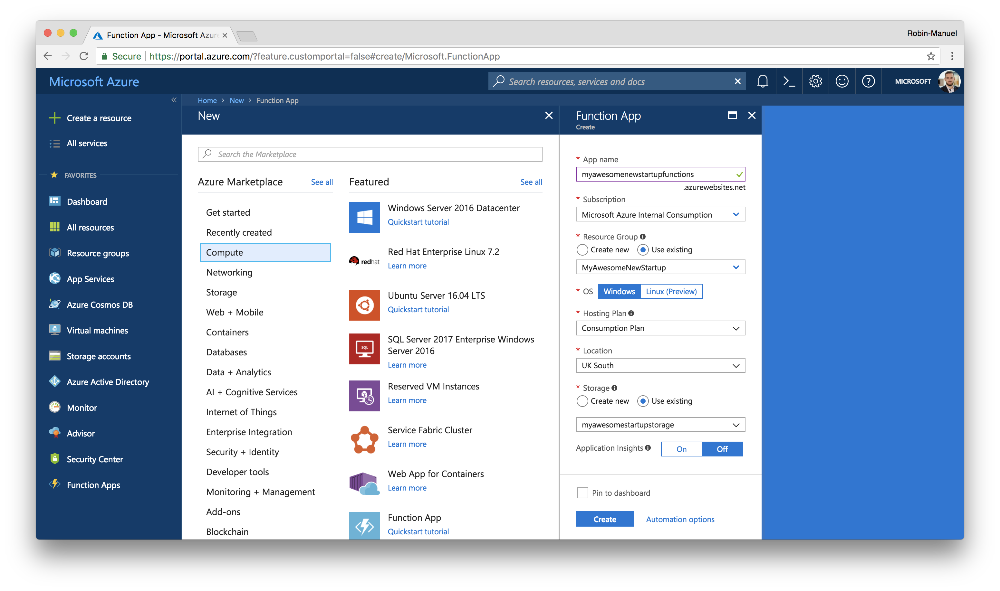

# Smart Image Resizing with Azure Fuctions and Cognitive Services

We have come to a point where our backend grew to a pretty solid state so let's do some of the more advanced stuff and add some intelligence to it! Not every developer has a background in Machine Learning and Artificial Intelligence to we should start with something simple: **Resizing uploaded images in an intelligent way**.

You remember, users can add photos to *Jobs* and upload them through the Web API sothat they get stored in the Blob Storage. These photos are uploaded and stored in **full size**, which results in high network traffic and download times when the Mobile App is fetching them. Sometimes the App just needs a small or preview version of the photo, so it would be nice to store some smaller sizes of the photos in addition to the orginnally uploaded ones.

The problem with simple resizing of the images to a certain square resolution like 150 x 150 pixels for thumbnail icons could cut off important parts of a picture that got taken in portrait- or landscape format. This is why it is recommended to use AI to understand what is shown on a picture and crop it accordingly.

## 1. Microsoft Cognitive Services

Great resources of Intelligence Services for developers without deeper Machine Learning knowledge are [Microsoft's Cognitive Services](https://azure.microsoft.com/en-us/services/cognitive-services/). These are a set of pre-trained Machine Learning APIs across various sections like Vision, Speech or Knowledge that developer's can simply include within their applications using a REST API.

### 1.1 Computer Vision for thumbnail generation

One of these APIs is [Computer Vision](https://azure.microsoft.com/en-us/services/cognitive-services/computer-vision/), a service that tries to understand what's on a picture or video. This service can analyze pictures to generate tags and captions, detect adult or racy content, read text in images, recognizes celebrities and landmarks, detects faces and emotions and much more. You should definitely take some time to explore and play around with all these services!

The perfect service for our scenario is the [Thumbnail Generation API](https://westcentralus.dev.cognitive.microsoft.com/docs/services/56f91f2d778daf23d8ec6739/operations/56f91f2e778daf14a499e1fb) which allows us to upload a picture together with a preferred size and get a cropped image back that does not miss out important parts of the original photo.

### 2.1 Get access through Azure

Microsoft Cognitive Services are hosted in various Azure Regions and can be consumed through an Azure Subscription. They are priced by transactions with numerous **free transactions** every month and a pay-per-use model for each additional request.

To add Computer Vision to our solution, enter the [Azure Portal](https://portal.azure.com) and click on the ***Create a resource*** button, find ***AI + Cognitive Services*** and select ***Computer Vision API*** to configure access to the API.

Choose the following settings and hit the ***Create*** button to start.

- **ID:** myawesomenewstartupcognitivevision
- **Location:** Same as your Web App(or close as Cognitive Services are not available in all Regions)
- **Pricing tier:** F0
- **Resouce Group:** Use existing

Once the deployment is succeeded, you can navigate to the resource and access the API Key from the ***Keys*** section.

## 2. Azure Functions

Functions are a **Serverless** component of Microsoft Azure and abstract even more of the underlying hardware that Platform-as-a-Service (PaaS) offerings like App Service does. An Azure Functions basically just persists of a code snipped and some meta information when and how it should get executed. This code snipped sleeps until it got triggered by an event or other service, wakes up then, executes its code and falls asleep again.

This behaviour allows Microsoft to offer a [**very attractive pricing model**](https://azure.microsoft.com/en-us/pricing/details/functions/) where you only pay for pure execution time of an Azure Function. That means you only pay and Azure Function when it is actually used. If you write code that never gets executed, it won't cost you anything! The ultimate idea of cloud computing! Event better, [the first 1 million executions or 400000 GB-s are free](https://azure.microsoft.com/en-us/pricing/details/functions/)!

> **Hint:** Azure Functions are the ideal service to extend existing large backend architectures with additional functionality or to process data in the cloud. The ladder is exactly what we need to do when resizing images. 

Whenever a user uploads an image, he shall get an immediate feedback and should not have to wait for the Cognitive Services. Once the image got dropped to the Blob Storage, the Function awakes and calls the Cognitive Service API to resize it in a smart way in the background. Next time, a user fetches images, he will receive the reseized versions.

### 2.1 Create an Azure Function

Multiple Azure Functions are hosted in a *Function App*. To create one, click the ***Create a resource*** button at the top-left corner of the [Azure Portal](https://portal.azure.com), select ***Compute*** from the categories and click on ***Function App***.

Add a *Function App* to your solution using the following properties.

- **App name:** myawesomenewstartupfunctions
- **Resouce Group:** Use existing
- **OS:** Windows
- **Hosting Plan:** Consumption Plan
- **Location:** Same as your Web App
- **Storage:** Use existing (same Storage Account as created for Blob Storage)

Click the ***Create*** button and wait until Azure provisioned your Function App.

#### 2.1.1 Explore Function Apps

Once the Function App got created, we can navigate to it and start exploring the Dashboard. There is not much to see, as we have not any Functions and the moment and the Funtion App just acts as a container for those.

There are multiple ways to add Azure Functions. One is to click the small ***+*** button next to the ***Functions*** entry in the side menu and start from scratch. You can see, that Azure Functions are suitable for different scenarios like Webhooks, Timed executions or Data processing. This basically defines, when a Functions should be triggered. Azure also supports different programmiung languages.

We have already prepared an Azure Function so we don't need to start from scratch! Let's take a look at the code and deploy it to our Function App from Visual Studio Code!

#### 2.1.2 Tooling

https://marketplace.visualstudio.com/items?itemName=ms-azuretools.vscode-azurefunctions

#### 2.1.3 Inputs and Outputs

#### 2.1.4 Triggers

### 2.3 Integrate into Azure

### 2.4 Integtrate Cognitive Services

### 2.5 Test the Azure Function locally

### 2.6 Deploy to Azure

### 2.7 Test