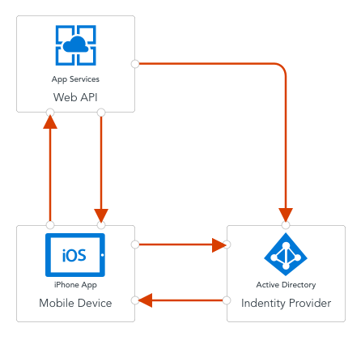

# Authentication 

## Concepts
One of the very first things you want to do when developing a mobile app is to provide users with a unique experience. For our field service app, this could be as simple as providing a job list for the user who is logged in. In more complex applications, this is the gateway to role-based access controls, group rules, and sharing with your friends. In all these cases, properly identifying the user using the phone is the starting point.

Authentication provides a process by which the user that is using the mobile device can be identified securely. This is generally done by entering a username and password. However, modern systems can also provide multi-factor authentication, send you a text message to a registered device, or use your fingerprint as the password. 

### The OAuth Process
In just about every single mobile application, a process called OAuth is used to properly identify a user to the mobile backend. OAuth is not an authentication mechanism in its own right. It is used to route the authentication request to the right place and to verify that the authentication took place. There are three actors in the OAuth protocol:

* The Client is the application attempting to get access to the resource.
* The Resource is the mobile backend that the client is attempting to access.
* The Identity Provider (or IdP) is the service that is responsible for authenticating the client.

At the end of the process, a cryptographically signed token is minted. This token is added to every request made by the client to the resource to securely identify the user.

### Server Side vs. Client Side
There are two types of authentication flow: Server-flow and Client-flow. They are so named because of who controls the flow of the actual authentication.

