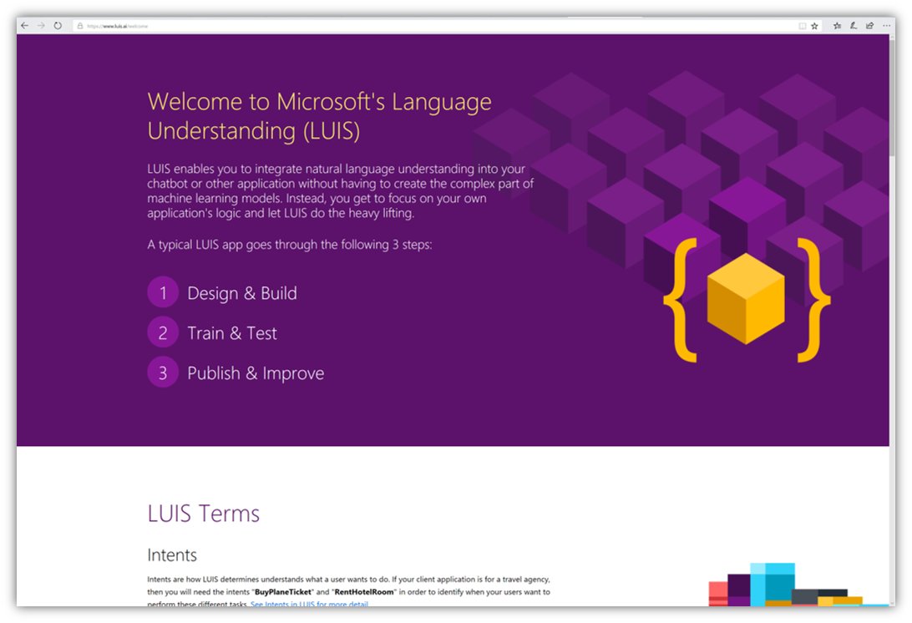
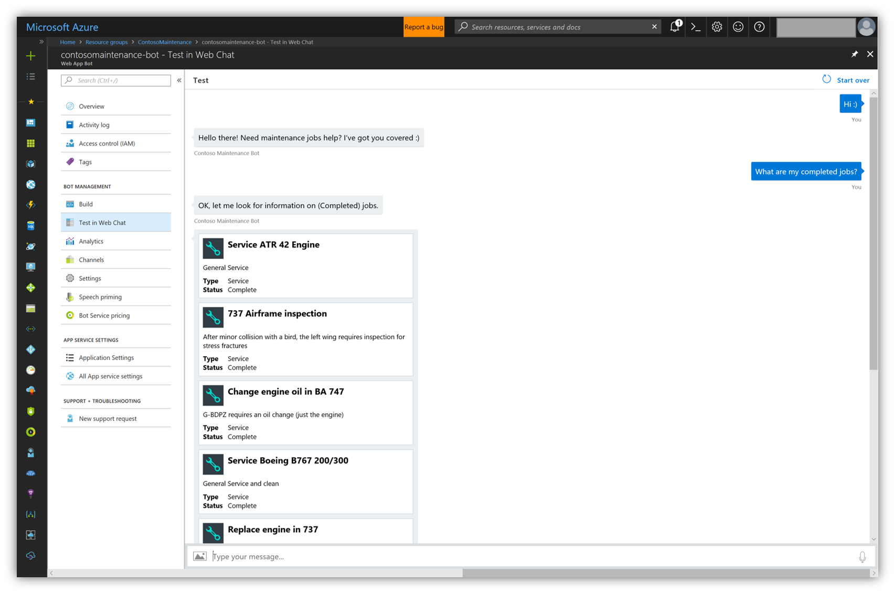



Creating intelligent infused apps is now the norm to stay current and competitive. Microsoft offers a wide variety of AI platforms that can be consumed through any device.

Bots are a fantastic channel to deliver intelligent experience. Contoso Maintenance Bot offers a conversational bot that integrates with Azure Search to retrieve relevant jobs from CosmosDB. The bot uses Microsoft’s Bot Framework with LUIS (Language Understanding Intelligent Service).

Creating an intelligent bot for Contoso Maintenance is a simple 4 steps process. First the LUIS model, the bot app, the bot backend and finally the mobile integration. 

##  1. LUIS (Language Understanding Intelligent Service)
LUIS enables you to integrate natural language understanding into your chatbot or other application without having to create the complex part of machine learning models. Instead, you get to focus on your own application's logic and let LUIS do the heavy lifting.

Starting with the intelligence part of the bot, LUIS, you can start by creating your model at https://www.luis.ai/  (or https://eu.luis.ai/ if you intend to host your bot in European data centers). There you will find a link to sign up along with abundant information to get you started.



A typical LUIS app goes through the following three steps: build, train and publish.

### 1.1 Design and building
Start by creating new LUIS app (after signing up or in) by inputting a simple dialogue:


After creating your app (or opening an existing app) make sure that (Build) tab is selected in your app.


Let’s get out of the ways a few terms that you need to be familiar with in LUIS:

***Intents***

Intents are how LUIS determines what a user wants to do. If your client application is a travel agency, then you will need the intents "ListJobs" and "RentHotelRoom" in order to identify when your users want to perform these different tasks. See Intents in LUIS for more detail. 

***Utterances***

An utterance is a textual input that LUIS will interpret. LUIS first uses example utterances that you add an intent to teach itself how to evaluate the variety of utterances that users will input. See Utterances in LUIS for more detail. 

***Entities***

You can think of entities like variables in algebra; it will capture and pass relevant information to your client app. In the utterance, "I want to buy a ticket to Seattle", you would want to capture the city name, Seattle, with the entity, like destination_city. Now LUIS will see the utterance as, "I want to buy a ticket to {destination_city}". This information can now be passed on to your client application and used to complete a task. See Entities in LUIS for more detail. 

Now let’s start by creating a new intent, in our case “greeting” intent. Next is writing as many Utterance as you need to represent a user greeting:


Greeting intent is easy in our case; just we want to respond to this by saying “welcome, this is what I can do…”

You can include a cancel intent to indicate that user does not wish to proceed or to disregard their request (in our case we are not using one).

Moving on with a more complex intent that utilises entities, “services.listjobs” intent. Below is a screenshot of the suggested completed one:


When creating intents that have entities that you would like to extract, you need to add them to the entities tab (on the right). 

Usually, I start by writing few utterances to gauge my entities if I have no clue about where to start. You can check if the entities are detected correctly or not by monitoring the blue boxes in your utterances.

Entities support multiple types based on its nature. In ContosoMaintenance we used List types only.


### 1.2 Train and test
After updating the entities or updating any of the utterances, you need to re-train your model which indicated by a red bulb in the train button:


Click train often after completing a set of changes. Also, you need to do this before trying to test your model.

You can access the test by clicking on the blue test button:


Before moving to the next step, just keep in mind that LUIS builder can help you get started with intent creation through “Add pre-built domain intent” which will generate an intent based on a predefined template.

### 1.3 Publish & improve
After you are satisfied with LUIS model (you should be proud 😊), it is time to publish it to the world through the Publish tab:


You will notice that under your relevant region you will have an initial starter key at the bottom of the publish page. This key includes low bandwidth that is suitable only for basic testing. 

To get a production grade key, you need to go to [Azure Portal](https://portal.azure.com) and issue a new cognitive service key.

Under New -> AI + Cognitive Services you will find Azure marketplace services for provisioning a new LUIS key that can be used in production.


Enter the service details and click create.


Once it is provisioned, you can find your keys by navigating to it:


Copy your primary key and add it to your LUIS app on the builder website (https://www.luis.ai or https://eu.luis.ai).

> **Hint:** It may take several mins for your new keys to be accessible. Please wait a bit before start using them.

Although you are ready for prime time, you will probably go back to your model and introduce improvements and adjustments on a regular basis to make sure to continue to present the best value to your bot users.

##  2. Chat Bot
Now we have our brain behind our Bot good to go; it is time to think about the bot itself. So bots in a general terms are automation software. This means they are essentially stupid 😊. What makes a bot smart or not, are the actual services that it automates the communication to and from.
 
What you need to have your bot up and running with basic functionality is a bot app and a bot backend.

### 2.1 Azure Bot Service
Azure Bot Service allows you to build, connect, deploy, and manage intelligent bots to naturally interact with your users on a website, app, Cortana, Microsoft Teams, Skype, Slack, Facebook Messenger, and more. Get started quick with a complete bot building environment, all while only paying for what you use.

It also speeds up development by providing an integrated environment that's purpose-built for bot development with the Microsoft Bot Framework connectors and BotBuilder SDKs. Developers can get started in seconds with out-of-the-box templates for scenarios including basic, form, language understanding, question and answer, and proactive bots.

You can start by creating a bot service on Azure Portal by selecting New -> AI + Cognitive Services -> Web App Bot. This will create all the needed resources to run your bot as fast as possible.


By selecting Language understanding as the startup code template, it will provide the service and deploy source code with bot framework integrated and starter LUIS integration. 

> **Hint:** You can then download the source code of the provisioned bot through the FTP URL provided in the bot Web App service.

Below is the architecture of the bot components.


### 2.2 Bot Web App Backend
Now you have a bot service that is ready for your development input. Bot backend is located here Mobile-Cloud-Workshop/Backend/BotBackend/ in the git repo. Open the solution in Visual Studio 2017 (Community edition will work as well).

> **Hint:** As we develop this project, Bot framework didn’t fully support .NET Core. This meant that we couldn’t develop it on a Mac as we needed the full .NET Framework library to leverage all the features of the Bot Framework. Bot team is working on releasing a full .NET Core support soon.

After starting working with the solution, the first thing is to update the settings in the web.config section below with your keys:
```xml
<appSettings>
    <!-- update these with your Microsoft App Id and your Microsoft App Password-->
    <add key="MicrosoftAppId" value="YOURS" />
    <add key="MicrosoftAppPassword" value="YOURS" />
    <add key="SearchName" value="YOURS" />
    <add key="IndexName" value="YOURS-index" />
    <add key="SearchKey" value="YOURS" />
    <add key="LuisAppId" value="YOURS" />
    <add key="LuisAPIKey" value="YOURS" />
    <add key="LuisAPIHostName" value="YOURS" />
    <add key="AzureWebJobsStorage" value="YOURS" />
    <add key="BotCardsBlobStorageURL"  value="YOURS" />
</appSettings>
```


After updating the keys, you can publish the project to Azure directly from Visual Studio publish options (right-click the project -> Publish). You can connect directly to Azure using your credentials or Import Profile (you can get the publishing provide from the bot web app overview window -> Get publish profile)

You are done! Congratulations! 

Now to test the actual bot implementation and code you can open your bot service from Azure and click on the blade says “Test in Web Chat”



> **Hint:** As a recommended practice, you should remove all of your secrets from web.conig and put them inside the “App Settings” blade on Azure Web App service. This way you avoid checking in your secrets in source control.


##  3. Integration with Mobile App
So now after you have built, tested and deployed your bot you can easily integrate in a Mobile App through a simple WebView screen. Just find your Web channel bot URL and included in your app.


You can reach the Web channel configuration page from the "Channels" blade in your Azure Bot Service instance.

> **Hint:** To have more control on the bot interactions and improve user experience, it is recommended to replace the WebView approach with a more solid native experience. This is done through using configuring and using “Direct Channel” on your bot. Direct channel is about using pure APIs to communicate with the bot. Refere back to Bot Framework documentation for more inforamtion


---
# Next Steps 
[Authentication](../11%20Authentication/README.md)
