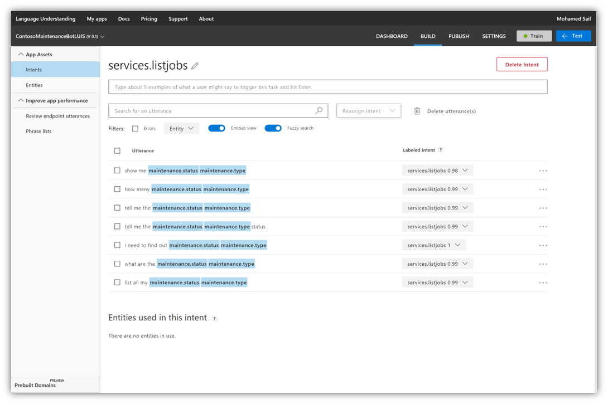
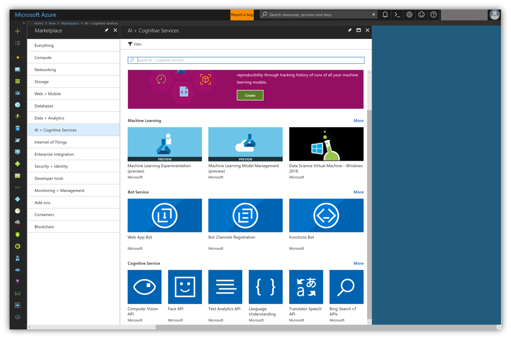



# Contoso Maintenance Bot

Creating intelligent infused apps is now the norm to stay current and competitive. Microsoft offers a wide variety of AI platforms that can be consumed through any device.

Bots is an amazing channel to deliver intelligent experience. Contoso Maintenance Bot offers a conversational bot that integrates with Azure Search to retrieve relevant jobs from CosmosDB. The bot uses Microsoft’s Bot Framework with LUIS (Language Understanding Intelligent Service).

Creating an intelligent bot for Contoso Maintenance is a simple 4 steps process. First the LUIS model, the bot app, the bot backend and finally the integration mobile app. 

##  1. LUIS (Language Understanding Intelligent Service)
LUIS enables you to integrate natural language understanding into your chatbot or other application without having to create the complex part of machine learning models. Instead, you get to focus on your own application's logic and let LUIS do the heavy lifting.

Starting with the intelligence part of the bot, LUIS, you can start by creating your model at https://www.luis.ai/  (or https://eu.luis.ai/ if you intend to host you bot in European data centers). There you will find a link to sign up along with rich information to get you started.

A typical LUIS app goes through the following 3 steps: build, train and publish.

### 1.1 Design and building
Start by creating new LUIS app (after signing up or in) through inputting a simple dialog:

After creating your app (or opening an existing app) make sure that (Build) tab is selected in your app.

Let’s get out of the ways a few terms that you need to be familiar with in LUIS:

***Intents***

Intents are how LUIS determines understands what a user wants to do. If your client application is for a travel agency, then you will need the intents "ListJobs" and "RentHotelRoom" in order to identify when your users want to perform these different tasks. See Intents in LUIS for more detail. 

***Utterances***

An utterance is the textual input that LUIS will interpret. LUIS first uses example utterances that you add to an intent to teach itself how to evaluate the variety of utterances that users will input. See Utterances in LUIS for more detail. 

***Entities***

An entity is used like a variable in algebra, it will capture and pass important information to your client app. In the utterance, "I want to buy a ticket to Seattle", you would want to capture the city name, Seattle, with the entity, like destination_city. Now LUIS will see the utterance as, "I want to buy a ticket to {destination_city}". This information can now be passed on to your client application and used to complete a task. See Entities in LUIS for more detail. 

Now let’s start by creating a new intent, in our case “greeting” intent. Next is writing as many Utterance as you need to represent a user greeting:

Greeting intent is simple in our case, just we want to respond to this by saying “welcome, this is what I can do…”

You can include cancel intent as well to indicate that user do not wish to proceed or to disregard their request (in our case we are not using one) .

Moving on with a more complex intent that utilizes entities, “services.listjobs” intent. Below is a screenshot of the suggested completed one:

When creating intents that have entities that you would like to extract, you need to add them to the entities tab (on the right). 

Usually I start by writing few utterances in order to gauge my entities if I have no clue about where to start. You can check if the entities are detected correctly or not by monitoring the blue boxes in your utterances.

Entities support multiple types based on its nature. In ContosoMaintenance we used List types only.

### 1.2 Train and test
After updating the entities or updating any of the utterances, you need to re-train your model which indicated by a red bulb in the train button:

Click train often after completing a set of changes. Also you need to do this before trying to test your model.

You can access the test through clicking on the blue test button:

Before moving to the next step, just keep in mind that LUIS builder can help you get started with intent creation through “Add prebuilt domain intent” which will generate an intent based on a predefined template.

### 1.3 Publish & improve
After you are satisfied with LUIS model (you should be proud 😊), it is time to publish it to the world through the Publish tab:

You will notice under your relevant region, you will have an initial starter key at the bottom of the publish. This key include very limited bandwidth that is suitable only for basic testing. 

To get production grade key, you need to go to [Azure Portal](https://portal.azure.com) and issue new cognitive service key.

Under New -> AI + Cognitive Services you will find Azure market place services for provisioning a new LUIS key that can be used in production.

Enter the service details and click create.

Once it is provisioned, you can find your keys by navigating to it:

Copy your primary key and add it to your LUIS app on the builder website (https://www.luis.ai or https://eu.luis.ai).

Pro-tip: It may take several mins for your new keys to be accessible. Please wait a bit before start using them.

---
# Next Steps 
[Authentication](../11_Authentication/README.md)
