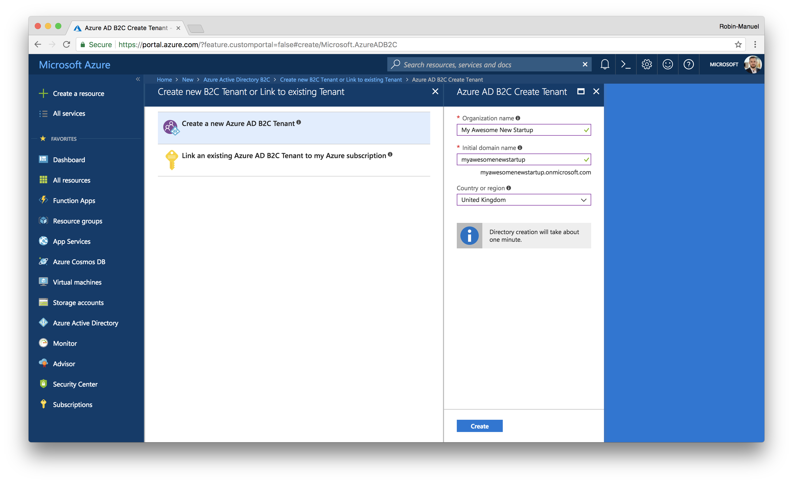
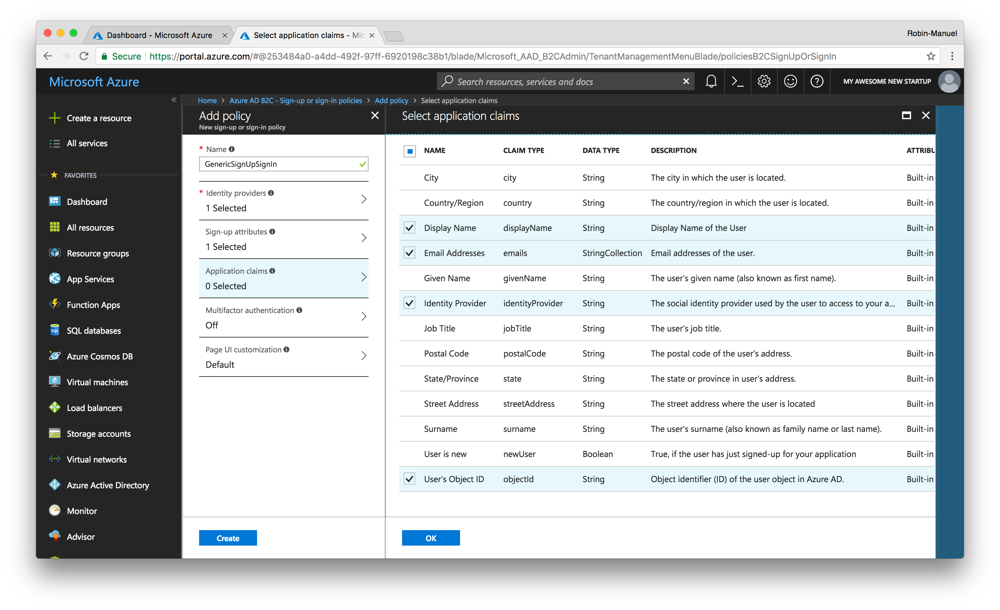
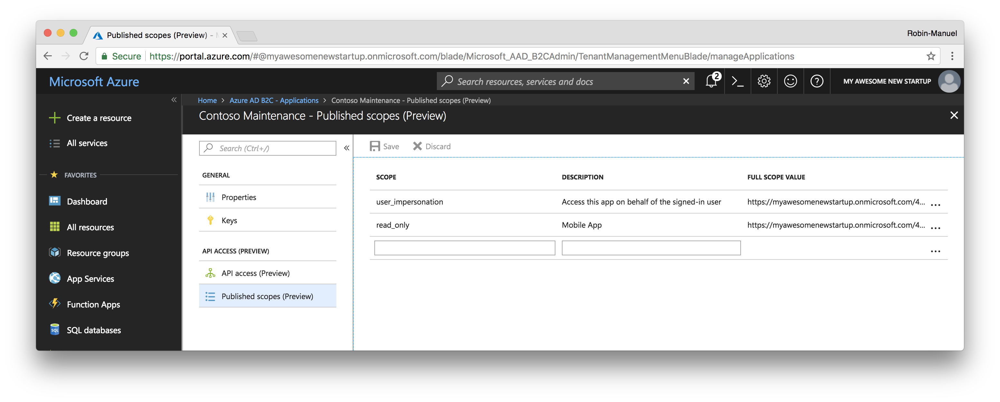
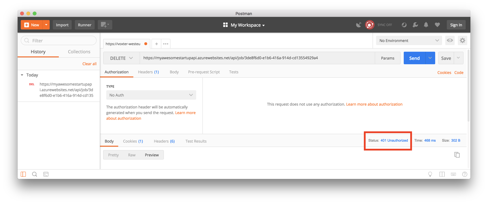
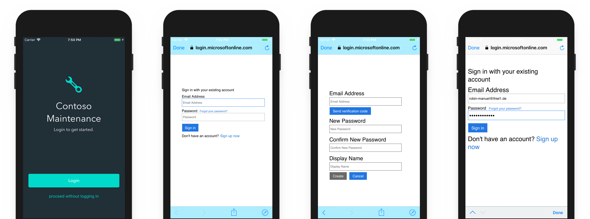

# Authentication

Adding Authentication to our app and backend is a little outside of the scope of today's workshop due to time constraints. We believe Authentication is an important enough topic that we've opted to include a guide for you to get an understanding of the key concepts required to implement any Identity Provider into your projects. For that, we chose [Azure Active Directory B2C](https://azure.microsoft.com/services/active-directory-b2c/) to manage users and authentication as our service of choice.

> **Hint:** The Mobile App uses the [OAuth 2.0 Implicit Authentication flow](https://oauth.net/2/grant-types/implicit/), which shows the user an Web Browser windows instead of native Textboxes for entering username and password. This adds security as users don't have to trust the app developer to store and hanlde their passwords securely.
>
> Although Azure ADB2C also supports a [native login with resource owner password credentials flow (ROPC)](https://docs.microsoft.com/en-us/azure/active-directory-b2c/configure-ropc?WT.mc_id=b2c-twitter-masoucou), it is [not recommended from a security perspective](https://www.scottbrady91.com/OAuth/Why-the-Resource-Owner-Password-Credentials-Grant-Type-is-not-Authentication-nor-Suitable-for-Modern-Applications).

#### Why Azure Active Directory B2C

For our business driven application, Azure Active Directory B2C (short: Azure ADB2C) is a perfect match because of the following reasons:

- Super simple or super custom authentication flow
- Supports open standards to integrate with all technology stacks
- Support for Social Authentication Providers (like Facebook)
- Scale to hundreds of millions of customers
- Use a white label solution, promote your brand
- Integrates with existing Active Directories or CRM and marketing databases

#### What does it cost

The [Azure Active Directory B2C pricing](https://azure.microsoft.com/en-us/pricing/details/active-directory-b2c/) is quite simple and straightforward. The **first 50.000 users and authentication per month are free** so we basically start without any upfront costs. Once we exceed this threshold, we will pay for additional users staggered.

## 1. Create a new Azure Active Directory B2C

Creating a new Azure Active Directory Service is a bit tricky and requires some steps that can be a bit confusing so let us go through them together carefully.

### 1.1 Create a new Tenant

Browse to the [Azure Portal](https://portal.azure.com), click the ***Create a new resource*** button, search for *"Azure Active Directory B2C"* and click the ***Create*** button of the regarding blade to start the creation wizard.


As we want to create a new Tenant, we should click on ***Create a new Azure ADB2C Tenant*** and fill in the required info.



Click the ***Create*** button to kick-off the creation process.

### 1.2 Link the Tenant with your Azure Subscription

Once the Tenant has been created, it needs to be linked to an Azure Subscription. This step can be done in the same window by clicking on the second option ***Link an Existing Azure AD B2C Tenant to my subscription*** and selecting the recently created Tenant in the opening blade.


Fill in the required information and hit **Create**.

- **Azure ADB2C Tenant:** Your recently created Tenant
- **Azure ADB2C Resource name:** *Filled in automatically*
- **Resource Group:** Use existing

## 2. Configure the Active Directory

When we navigate to the B2C Tenant that we have just created, we will not see many details or configuration options. This is simply because it lives in its own Directory within Microsoft Azure. So we need to switch directories. For this, either click the ***Azure AD B2C Settings*** button or switch directories by clicking on your account in the top-right corner.


### 2.1 Add a new Sign-up or sign-in policy

Enabling users to log into our Active Directory or to create an Account in there by themselves is a good start. For this, we need a *Policy*. In Active Directory, Policies define how users can log in, which Authentication Providers (like Facebook) they can use and what important information is, that users have to provide.

To add a new Policy, click on ***Sign-up or sign-in policies*** in the side menu of the Azure AD B2C window and add a new Policy using the ***Add*** button at the top.


When defining a new policy, Azure will ask you for a bunch of attributes so let's inspect them quickly to make the right choices.

#### Identity providers

The services, we want to allow users to register at and log into our application. We can select classic E-Mail signup here, where users define an E-Mail address and password or Social Login Providers like Facebook. As we don't have any social authentication configured yet, E-Mail signup will be the only selectable option at the moment. We can add other authentication providers later.

#### Sign-up attributes

We already talked about these. Here we can define, which information a user has to provide to us, when he signs up for our application for the first time.

#### Application claims

This is the information that Active Directory gives back to our application once the user logs in. We definitely  want to get his **User's Object ID** but also might want to get his name or address back.

#### Multifactor authentication

If we want to enhance security through an additional authentication factor, we can enable it here.

#### Page UI customization

As you can see later, the Login UI looks pretty poor by default. Here we can change styling and add corporate CI to the login flow to let it look like a natural part of our application. For the purpose of this tutorial, we can leave it as it is.



Create your first policy with the inputs below and confirm your selections with the ***Create*** button.

- **Name:** GenericSignUpSignIn
- **Identity providers:** Email signup
- **Sign-up attributes:** Display Name
- **Application claims:** Display Name, Email Addresses, Identity Provider, User's Object ID
- **Multifactor authentication:** Off
- **Page UI customization:** Default

## 3. Setup the Active Directory Application

Now that users can sign-up and log into our Active Directory, we need to register the application itself. 

### 3.1 Create a new Application

Select the ***Applications*** menu and click the ***Add*** button from the new blade that appears.

Here you're going to give the Azure AD B2C application a name and specify whether it should contain a Web API and Native client. You want to do both, so we select ***Yes*** on both options which let a bunch of options appear.


#### Web APP / Web API configuration

Here we configure our backend and API. The **Redirect Uri** gets called to tell a Website if a Login request was successful or not. As we don't use that, we can fill *any* URL in here. Although the **App ID URI** is optional, we need to fill it out as we need it for permissions and scopes later. It does not need to resolve to anything.

#### Native Client configuration

When configuring the native client, we should define a unique **Custom Redirect URI**. This URI is specifying a custom URL scheme that the web view which performs the sign-up and sign-in in the native app will use to communicate back to the app once the sign-up or sign-in is complete. The standard for Active Directory is `msal{APPLICATION-ID}://auth`.

Fill in all the values and register the application with the ***Create*** button.

- **Name:** Contoso Maintenance
- **Include Web App / Web API:** Yes
- **Allow implicid flow:** Yes
- **Reply URL:** `https://myawesomestartupapi.azurewebsites.net/api/login`
- **App ID URI:** `https://myawesomenewstartup.onmicrosoft.com/`**`backend`**
- **Native client:** Yes
- **Custom Redirect URI:** `msalcontosomaintenance://auth`

Once the application is registered, we can get its unique id from the overview page of the portal. We will need this a couple of times, when configuring Frontend and Backend later.

### 3.2 Define a new Scope

The idea behind scopes is to give permission to the backend resource that's being protected, so we should define a new one for the Mobile App.



Hit the ***Published scopes*** menu option and enter any name and description. We could call it "read_only" for example.

### 3.3 Activate API Access

Once we have a scope defined, we can enable API Access for it. Our Mobile App needs it to communicate with the Active Directory and gain Access Tokens for its users.


Click the ***API Access*** menu item and add a new API for our application and select the "read_only" scope that we just created.

## 4. Connect the Web Api Backend with Azure Active Directory

Not that the Active Directory is set up, we can connect it to the Backend and introduce it as the Identity Provider of choice. As ASP.Net Core has support for authentication built-in, not much code is needed, to add Active Directory Authentication application-wide.

> **Hint:** Remember, although we use existing libraries in our Backend and Frontend projects, Azure Active Directory B2C is based on open standards such as OpenID Connect and OAuth 2.0 and can be integrated into any framework out there.

In the Backend's [`Startup.cs`](/Backend/Monolithic/Startup.cs) class, the Active Directory connection is already provided as shown below.

```csharp
public void ConfigureServices(IServiceCollection services)
{
    // ...

    // Add Azure Active Directory B2C Authentication
    services.AddAuthentication(options =>
    {
        options.DefaultScheme = JwtBearerDefaults.AuthenticationScheme;
    })
    .AddJwtBearer(options =>
    {
        options.RequireHttpsMetadata = false;
        options.Audience = Configuration["ActiveDirectory:ApplicationId"];
        options.Events = new JwtBearerEvents
        {
            OnAuthenticationFailed = AuthenticationFailed
        };

        var authorityBase = $"https://login.microsoftonline.com/tfp/{Configuration["ActiveDirectory:Tenant"]}/";
        options.Authority = $"{authorityBase}{Configuration["ActiveDirectory:SignUpSignInPolicy"]}/v2.0/";
    });

    // ...
}
```

[View in project](/Backend/Monolithic/Startup.cs#L47-L65)

As you can see, we use `Configuration` variables one more time to not hard code the config properties. So it takes the Azure Active Directory config out of the Environment Variables as defined in [`appsettings.json`](/Backend/Monolithic/appsettings.json).

```json
"ActiveDirectory": {
    "Tenant": "",
    "ApplicationId": "",
    "SignUpSignInPolicy": ""
}
```

[View in project](/Backend/Monolithic/appsettings.json#L30-L34)

Add the following secrets to your application as described in the according Secrets sections for App Services or Kubernetes.

> **Hint:** Here you can find the [App Service Secrets](/Walkthrough%20Guide/03%20Web%20API/01%20App%20Service#use-secrets) and [ Kubernetes Secrets](/Walkthrough%20Guide/03%20Web%20API/02%20Kubernetes#use-secrets) sections.

- **`ActiveDirectory__Tenant`:** "{OUR_AD}.onmicrosoft.com"
- **`ActiveDirectory__ApplicationId`:** *{ID_OF_THE_REGISTERED_APPLICATION}*
- **`ActiveDirectory__SignUpSignInPolicy`:** B2C_1_GenericSignUpSignIn

Some of the API calls to our backend requires, that a user is authenticated to proceed. `DELETE` operations are a good example for that. The code in the [`BaseController.cs`](/Backend/Monolithic/Controllers/BaseController.cs) has an `[Authenticate]` attribute added to the Delete function. This will automatically refuse calls from unauthenticated clients. In a real-word scenario, you would also want to check if the User's ID matches the owner ID of the item that gets deleted to make sure the client has the right permissions.

```csharp
[Authorize]
[HttpDelete("{id}")]
public async Task<ActionResult> DeleteAsync(string id)
{
    // Get ID of user who sends the request
    var userId = User.FindFirstValue(ClaimTypes.NameIdentifier);

    // TODO: Check, if the user is allowed to delete the item
    // Currently left out for demo reasons

    // ...
}
```

[View in project](/Backend/Monolithic/Controllers/BaseController.cs#L73-L100)

This basically means that if we fire a Delete request to the backend, without an Access Token in the Header, we will get back a **401 Unauthorized** response as shown in the Postman Screenshot below.



## 5. Configure the Mobile App

Most of the authentication code is already written in the App but let's go through the important parts quickly, to understand how everything is glued together.

Mostly, the whole process of Logging in, Logging out, Refreshing the Access Token in the background, handling the current user and so on lives in the [`AuthenticationService.cs`](/Mobile/ContosoFieldService.Core/Services/AuthenticationService.cs). Check it out, if you need more details on how Authentication is implemented on the client. It uses the [Microsoft.Identity.Client](https://www.nuget.org/packages/Microsoft.Identity.Client/) NuGet package (or MSAL) to take care of communicating to Azure AD B2C (and caching the tokens in response) for us. This removes a lot of work on our end.

The `AuthenticationService` gets configured with a set of variables in the [`Constants.cs`](/Mobile/ContosoFieldService.Core/Helpers/Constants.cs) file. As you can see, we define the recently created Scope "read_only" here.

```csharp
public static class Constants
{
    // ...

    // Azure Active Directory B2C
    public static string Tenant = "myawesomenewstartup.onmicrosoft.com";
    public static string ApplicationID = "{ID_OF_THE_REGISTERED_APPLICATION}";
    public static string SignUpAndInPolicy = "B2C_1_GenericSignUpSignIn";
    public static string[] Scopes = { "https://myawesomenewstartup.onmicrosoft.com/backend/read_only" };
}
```

[View in project](/Mobile/ContosoFieldService.Core/Helpers/Constants.cs#L15-L18)


### 5.1 iOS specific steps

In the iOS project, we have to edit the [`Info.plist`](/Mobile/iOS/Info.plist) file and add a URL type to define a callback URL that gets invoked when the web view is dismissed. We have configured this Callback URL earlier, when adding the Application to Active Directory and added the Native Client.

```xml
<key>CFBundleURLTypes</key>
<array>
    <dict>
        <key>CFBundleTypeRole</key>
        <string>Editor</string>
        <key>CFBundleURLName</key>
        <!-- Use your Bundle identifier here -->
        <string>com.contoso.contosomaintenance</string> 
        <key>CFBundleURLSchemes</key>
        <array>
            <!-- Use your Custom Redurect URI minus the ://auth -->
            <string>msalcontosomaintenance</string>
        </array>
    </dict>
</array>
```

[View in project](/Mobile/iOS/Info.plist#L62-L74)

Then we need to override the `OpenUrl` function in the AppDelegate. It's pretty straightforward and will look like this:

```csharp
public override bool OpenUrl(UIApplication app, NSUrl url, NSDictionary options)
{
    AuthenticationContinuationHelper.SetAuthenticationContinuationEventArgs(url);
    return true;
}
```

[View in project](/Mobile/iOS/AppDelegate.cs#L56-L60)

The `AuthenticationContinuationHelper` is from the MSAL library, and it's there to help us coordinate the authentication flow.

### 5.2 Android specific steps

In the Android app's `MainActivity`, we need to set that `UIParent` property. That's going to be done in the `OnCreate` function and will look like this:

```csharp
// Configure Authentication
AuthenticationService.UIParent = new UIParent(Xamarin.Forms.Forms.Context as Activity);
```

[View in project](/Mobile/Droid/MainActivity.cs#L44)

This `UIParent` allows the MSAL to show the web view using the current Android activity.

Then we need to modify the `AndroidManifest.xml` file. Add this into the `<application>` element:

```xml
<activity android:name="microsoft.identity.client.BrowserTabActivity">
    <intent-filter>
        <action android:name="android.intent.action.VIEW" />
        <category android:name="android.intent.category.DEFAULT" />
        <category android:name="android.intent.category.BROWSABLE" />
        <!-- Use your Custom Redurect URI minus the ://auth -->
        <data android:scheme="msalmsalcontosomaintenance" android:host="auth" />
    </intent-filter>
</activity>
```

[View in project](/Mobile/Droid/Properties/AndroidManifest.xml#L15-L22)

That new `<activity>` element is defining a browser window that can be opened and it's going to be used for the web view that lets users sign up or sign in to our app.

## 6. Understanding Authentication Processes

### 6.1 Login flow

For security reasons, OAuth2 dictates that User Logins have to be done via Web Views. When a user presses the Login button, the ([customizable](https://docs.microsoft.com/en-us/azure/active-directory-b2c/active-directory-b2c-reference-ui-customization)) Azure ADB2C Website pops-up and asks the user to create a new account or login with an exiting one. Once the process is finished, the Web View will redirect the results to the application.



When a user logs in and tries to access a protected resource at the Backend that requires authentication, usually a pre-defined login flow will be executed.


A successful login flow would look like this:

1. User opens Login window in the App
1. User logs in and gets an Access Token from the Authentication Provider
1. User sends request to Backend with Access Token
1. Backend contacts Authentication Provider to prove Token validity
1. Authentication Provider approves Token and returns User Account Details
1. Backend returns secure resources

### 6.2 Refresh Access Tokens

Access Tokens usually have a short time to live to provide additional security and let potential attackers that stole and Access Token only operate for a small time.

To avoid that the user has to login and acquire a new token every 30 minutes, the Access Token can be refreshed silently in the background. Usually, a Rrefresh Token is used for this. The Mobile App uses the ADAL library, which already provides a functionality to refresh the Access Token. Check out the [`AuthenticationService.cs`](/Mobile/ContosoFieldService.Core/Services/AuthenticationService.cs) for implementation details.

The App tries to refresh the Access Token automatically when it receives a `401 Unauthorized` response and only shows the Login UI to the user if the background refresh failed.

Check out the [Mobile Network Services](/Walkthrough%20Guide/09%20Mobile%20Network%20Services/) guide for additional details about resilient networking.

# Additional Resouces

There are several cool things you can do with Azure Active Directory, that will not be part of this workshop. If you want to go further, check out these links.

- [Add Social Authentication Providers](https://docs.microsoft.com/en-us/azure/active-directory-b2c/active-directory-b2c-setup-fb-app)
- [Customize the Login UI](https://docs.microsoft.com/en-us/azure/active-directory-b2c/active-directory-b2c-reference-ui-customization)
- [Enable Multifactor authentication](https://docs.microsoft.com/en-us/azure/active-directory-b2c/active-directory-b2c-reference-mfa)
- [Login with and existing Azure Active Directory Account](https://docs.microsoft.com/en-us/azure/active-directory-b2c/active-directory-b2c-setup-aad-custom)
- [Configure the resource owner password credentials flow (ROPC) for native login](https://docs.microsoft.com/en-us/azure/active-directory-b2c/configure-ropc)
