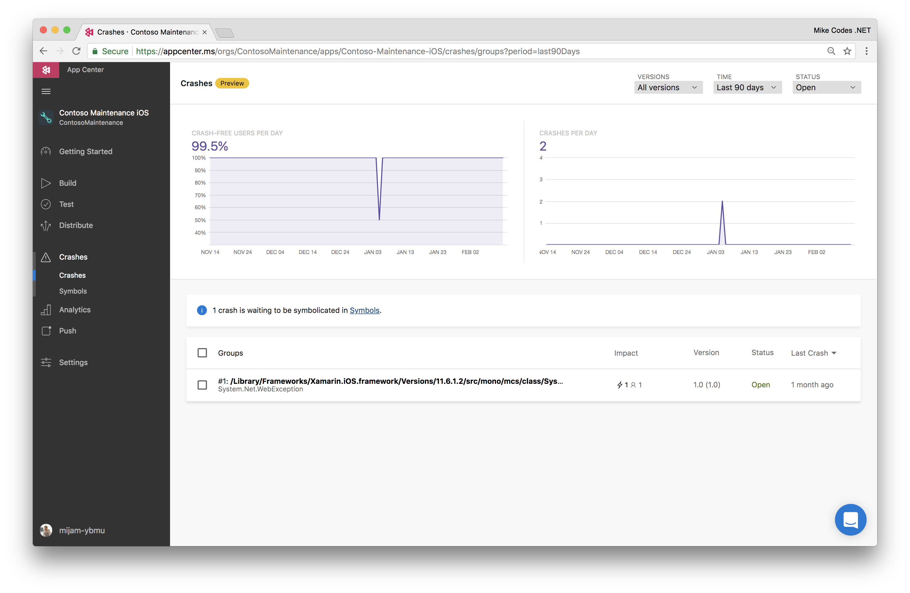
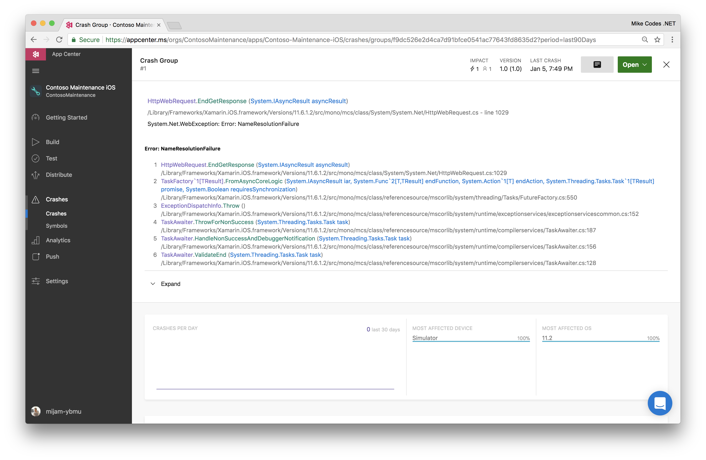

# App Center 
[App Center](https://www.visualstudio.com/app-center/) offers a rich suit of services aimed at mobile devlopers. We're going to use it today to add crash reporting, analytics and push notifications. We also have a CI/CD workshop that'll be running which covers the build and testing elements of mobile development. 

## Crash Reporting
App Center Crash Reporting lets us know when our app crashes on any device. 



Crashes are grouped together by similarities like the reason for the crash and where the occur in the app. It is possible to inspect each individual crash report for the last 3 months, after that a stub of 25 crashes will be kept.


## Analytics 
App Center Analytics will help you understand more about your app users and their behavior when using your app.


## Push 
Use App Center to easily send targeted and personalised push notifications to any mobile platform from any cloud or on-premises backend.

Push notifications is vital for consumer apps and a key compontent in increasing app engagement and usage. For enterprise apps, it can also be used to help communicate up-to-date business information. It is the best app-to-user communication because it is energy-efficient for mobile devices, flexible for the notifications senders, and available while corresponding apps are not active.

### How Push Notifications Works
Push notifications are delivered through platform-specific infrastructures called Platform Notification Systems (PNSes). They offer barebone push functionalities to delivery message to a device with a provided handle, and have no common interface. To send a notification to all customers across iOS and Android, we have to  work with APNS (Apple Push Notification Service) and FCM (Firebase Cloud Messaging).

At a high level, here is how push works:

1. The client app decides it wants to receive pushes hence contacts the corresponding PNS to retrieve its unique and temporary push handle. The handle type depends on the system (e.g. WNS has URIs while APNS has tokens).
2. The client app stores this handle in the app back-end or provider.
3. To send a push notification, the app back-end contacts the PNS using the handle to target a specific client app.
4. The PNS forwards the notification to the device specified by the handle.

Thankfully for us, the App Center SDK's handle most of this for us. In our app, all we have to do is ensure we start the AppCenter SDK with Push being enabled. It'll handle the rest for us. 

```
AppCenter.Start(
                Helpers.Constants.AppCenterIOSKey Helpers.Constants.AppCenterUWPKey Helpers.Constants.AppCenterAndroidKey,
                    typeof(Analytics), typeof(Crashes), typeof(Push));
``` 
[View in project](https://github.com/MikeCodesDotNet/Mobile-Cloud-Workshop/blob/5f49af15eb4ad44c9d98e4ded8c32ab6edf87d8d/Mobile/ContosoFieldService.Core/App.xaml.cs#L63)

### Configuring Notifications
#### iOS 
-Todo

#### Android
-Todo

### Sending Notifications
Sending push notifications is super simple. Start by clicking the "Send Notification" button in the top-right corner. 


Fill in the notification payload


Who do you want to send the notification to?


Does this look correct?


---
# Next Steps 
[Chat Bot](../10%20Chatbot/README.md)
