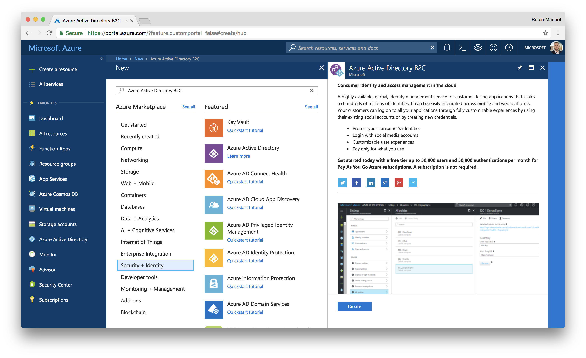
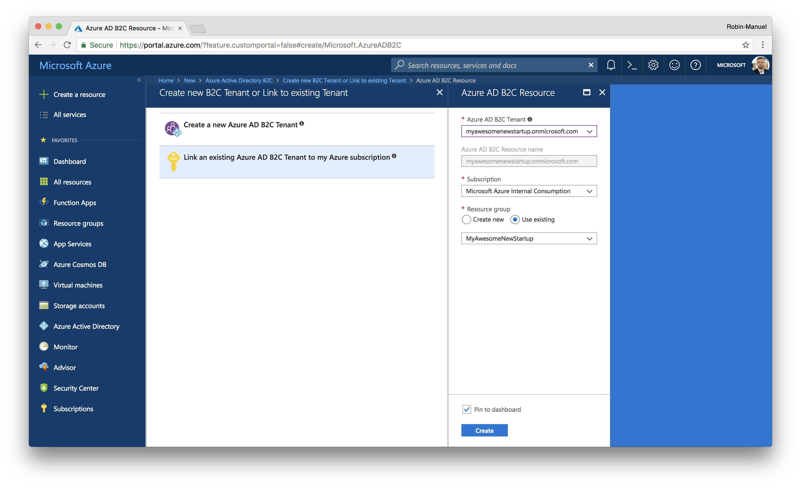
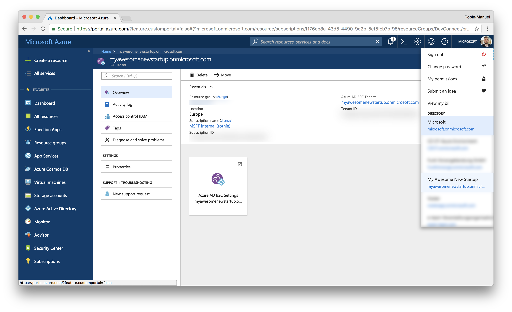
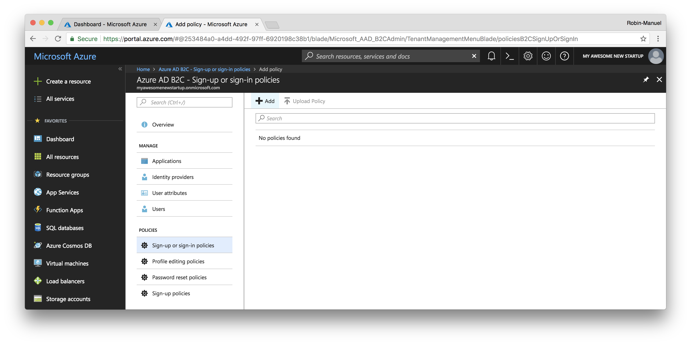
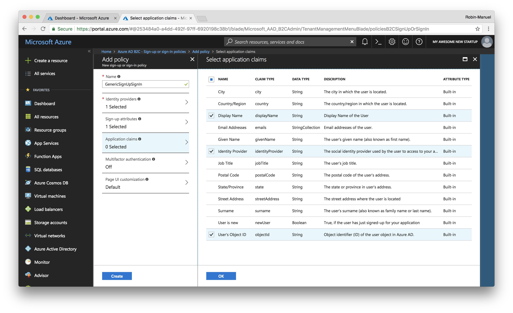

# Authentication

Adding Authentication to our app and backend is a little outside of the scope of todays workshop due to time constraints. We believe Authentication is an important enough topic that we've opted to include a guide for you to get an understanding of the key concepts required to implement any Indentity Provider in to your projects. For that, we chose [Azure Active Directory B2C](https://azure.microsoft.com/services/active-directory-b2c/) to manage users and authentication as our service of choice.

#### Why Azure Active Directory B2C

For our business driven application, Azure Active Directory B2C (short: Azure ADB2C) is a perfect match because of the following reasons:

- Super simple or super custom authentication flow
- Supports open standards to integrate with all technology stacks
- Support for Social Authentication Providers (like Facebook)
- Scale to hundreds of millions of customers
- Use a white label solution, promote your brand
- Integrates with existing Active Directories or CRM and marketing databases

## 1. Create a new Azure Active Directory B2C

Creating a new Azure Active Directory Service is a bit tricky and requires some steps that can be a bit confusing so let us go through them together carefully.

### 1.1 Create a new Tenant

Browse to the [Azure Portal](https://portal.azure.com), click the ***Create a new resource*** button, search for *"Azure Active Directory B2C"* and click the ***Create*** button of the regaring blade to start the creation wizard.



As we want to create a new Tenant, we should click on ***Create a new Azure ADB2C Tenant*** and fill in the required info.


Click the ***Create*** button to kick-off the creation process.

### 1.2 Link the Tenant with your Azure Subscription

Once the Tenant has been created, it needs to be linked to an Azure Subscription. This step can be done in the same window by clicking on the second option ***Link an Existing Azure AD B2C Tenant to my subscription*** and selecting the recently created Tenant in the opening blade.



Fill in the required information and hit **Create**.

- **Azure ADB2C Tenant:** Your recently created Tenant
- **Azure ADB2C Resource name:** *Filled in automatically*
- **Resource Group:** Use existing

## 2. Configure the Active Directory

When we navigate to the B2C Tenant that we have just created, we will not see many details or configuration options. This is simply because it lives in its own Directory within Microsoft Azure. So we need to switch directories. For this, either click the ***Azure AD B2C Settings*** button or switch directories by clicking on your account in the top-right corner.



### 2.1 Add a new Sign-up or sign-in policy

Enabling users to log into our Active Directory or to create an Account in there by themselves is a good start. For this, we need a *Policy*. In Active Directory, Policies define how users can log in, which Authentication Providers (like Facebook) they can use and what important information are, that users have to provide.

To add a new Policy, click on ***Sign-up or sign-in policies*** in the side menu of the Azure AD B2C window and add a new Policy using the ***Add*** button at the top.



When defining a new policy, Azure will ask you for a bunch of attributes so let's inspect them quickly to make the right choices.

#### Identity providers

The services, we want to allow users to register at and log into our application. We can select classic E-Mail signup here, where users define an E-Mail address and password or Social Login Providers like Facebook. As we don't have any social authentication configured yet, E-Mail signup will be the only selectable option at the moment. We can add other authentication providers later.

#### Sign-up attributes

We already talked about these. Here we can define, which information a user has to provide to us, the he signs up for our application for the first time.

#### Application claims

This is the information that Active Directory gives back to our application once the user logs in. We definitely  want to get his **User's Object ID** but also might want to get his name or address back.

#### Multifactor authentication

If we want to enhance security through an additional authentication factor, we can enable it here.

#### Page UI customization

As you can see later, the Login UI looks pretty poor by default. Here we can change styling and add corporate CI to the login flow to let it look like a natural part of our application. For the purpose of this turorial, we can leave it as it is.



Create your first policy with the inputs below and confirm your selections with the ***Create*** button.

- **Name:** GenericSignUpSignIn
- **Identity providers:** Email signup
- **Sign-up attributes:** Display Name
- **Application calims:** Display Name, Identity Provider, User's Object ID
- **Multifactor authentication:** Off
- **Page UI customization:** Default

## 3. Setup the Active Directory Application

Now that users can sign-up and log into our Active Directory, we need to register the application itself. For this, select the ***Applications*** menu and click the ***Add*** button from the new blade that appears.

Here you're going to give the Azure AD B2C application a name and specify whether it should contain a Web API and Native client. You want to do both, so we select ***Yes*** on both options which lets a bunch of options appear.


#### Web APP / Web API configuration

Here we configure our backend and API. The **Redirect Uri** gets called to tell a Website if a Login request was successful or not. As we don't use that, we can fill *any* URL in here. Although the **App ID URI** is optional, we need to fill it out as we need it for permissions and scopes later. It does not need to resolve to anything.

#### Native Client configuration

When configuring the native client, we should define a unique **Custom Redirect URI**. This URI is specifying a custom URL scheme that the web view which performs the sign-up and sign-in in the native app will use to communicate back to the app once the sign-up or sign-in is complete. The standard for Active Directory is `msal{APPLICATION-ID}://auth`.

Fill in all the values and register the application with the ***Create*** button.

- **Include Web App / Web API:** Yes
- **Allow implicid flow:** Yes
- **Reply URL:** `https://myawesomestartupapi.azurewebsites.net/api/login`
- **App ID URI:** `https://myawesomenewstartup.onmicrosoft.com/`**`backend`**
- **Native client:** Yes
- **Custom Redurect URI:** `msalcontosomaintenance://auth`

## 4. Connect the Web Api Backend with Azure ADB2C

Not that the Active Directory is set up, we can connect it to the Backend and introduce it as the Identity Provider of choice. As ASP.Net Core has support for authentication built-in, not much code is needed, to add Active Directory Authentication application-wide.

> **Hint:** Remember, although we use existing libraries in our Backend and Frontend projects, Azure Active Directory B2C is based on open standards such as OpenID Connect and OAuth 2.0 and can be integrated in any framework out there. 

```csharp
public void ConfigureServices(IServiceCollection services)
{
    // ...

    // Add Azure Active Directory B2C Authentication
    services.AddAuthentication(options =>
    {
        options.DefaultScheme = JwtBearerDefaults.AuthenticationScheme;
    })
    .AddJwtBearer(options =>
    {
        options.RequireHttpsMetadata = false;
        options.Audience = Configuration["ActiveDirectory:ClientId"];
        options.Events = new JwtBearerEvents
        {
            OnAuthenticationFailed = AuthenticationFailed
        };

        var authorityBase = $"https://login.microsoftonline.com/tfp/{Configuration["ActiveDirectory:Tenant"]}/";
        options.Authority = $"{authorityBase}{Configuration["ActiveDirectory:Policy"]}/v2.0/";
    });

    // ...
}
```

# Additional Resouces

There are a several cool things you can do with Azure Active Directory, that will not be part of this workshop. If you want to go further, check out these links.

- [Add Social Authentication Providers](https://docs.microsoft.com/en-us/azure/active-directory-b2c/active-directory-b2c-setup-fb-app)
- [Customize the Login UI](https://docs.microsoft.com/en-us/azure/active-directory-b2c/active-directory-b2c-reference-ui-customization)
- [Enable Multifactor authentication](https://docs.microsoft.com/en-us/azure/active-directory-b2c/active-directory-b2c-reference-mfa)