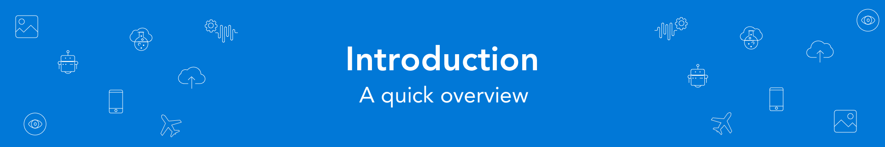

# Walkthrough Guide

Welcome to the Azure Mobile Workshop. Today you’re going to learn how to leverage your existing skills to build highly reliable backend systems to power a modern cross platform mobile app built using Xamarin.Forms.

We’ve tried to make this app as production ready as possible and provide a good foundation for if you wish to pursue development in the future. Think of this as your development starter kit. Where we think theres area for improvement within the code base, we've added explanations about how to improve them to bring them up to production standards. We've tried to pick non oppinionated frameworks to give you the flexibility to extend this app to fit your requirements. 

## Prerequisites

You should have already followed the [setup guide](01%20Setup/README.md) before attending the workshop. We've scheduled an hour before things start for you to get support with configuration, but please try your best to attend with a fully functioning development enviroment. 

This workshop is for intermediate to experienced C# developers who may lack either Azure or Xamarin experience. This workshop is not for C# beginners and we expect you to know how design patterns such as Mvvm and MVC as well as having a basic understanding of the differences between developing Web APIs vs Mobile front-ends. 

If you are unfamiliar with the C# language, you can get started with a free course on the Internet. The basics of the language can be learned at www.learncs.org. Once you have the language basics under your belt, you can move on to building applications with Xamarin. You should be ready to follow this guided workshop, creating both the front-end and backend to run a field service app.
