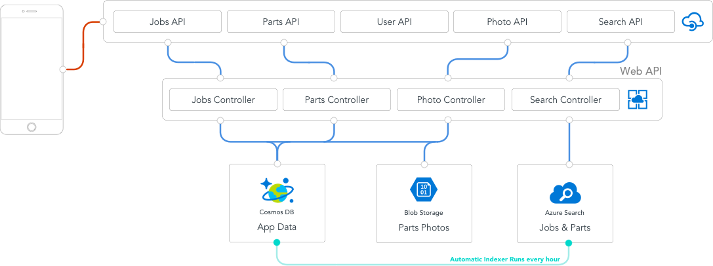
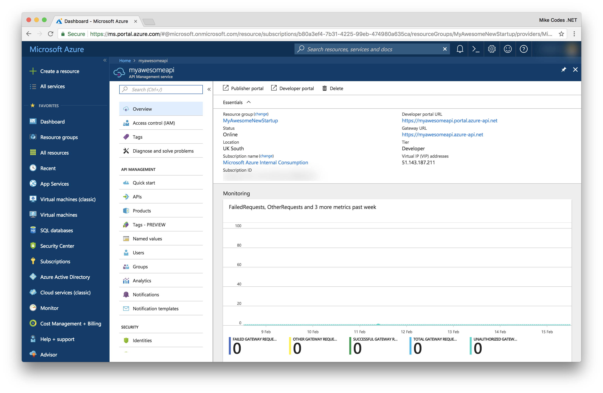

# API Management
Azure API Management is a turnkey solution for publishing APIs to external and internal consumers. It facilitates the quick creation of consistent and modern API gateways for existing backend services hosted anywhere, enabling security and protection of same APIs from abuse and overuse, and empowers organizations gain insights into API usage and health. Plus, automate and scale developer Onboarding to help get your API program up and running in no time.

We're using API Management in todays workshop to act as a barrier between our Azure Resources and the mobile app. 

## Key Features

### Security 
Azure API Management has a number of security features for ensuring access to back end services happen in a secure manner. 

* **Client profiling and Authorization:** consumers of backend API’s via API Management are created as users on the Developer portal and assigned to groups. These groups are granted access to Products accordingly. Products contain a set of 1 or more API definitions

* **Subscription keys:** consumers of backend API’s are assigned primary and secondary subscription keys. This key must be included in all requests made to the API. If the request isn't provided, we will return a 401 Invalid Subscription response. 

* **VPN’s and ExpressRoute:** with the Premium tier, virtual networks can be setup in Azure using a VPN (or ExpressRoute). This virtual network is used to bridge from  your internal network into Azure allowing API Management to invoke the back end API’s without their needing to be exposed publicly. 

### Authentication
* **OAuth Configuration:** configuration of OAuth 2.0 Authorization servers in APIM by specifying supported flows and configuration of endpoints. These can be subsequently associated with configured APIs. APIM can also be configured to check that requests have a valid JWT to prevent unauthorized requests from even reaching the your back-end APIs. This is configured through the use of policies

* **Mutual certificate authentication:** Client certificates can be configured on the back end services and uploaded to APIM. All communication would require authentication via these certificates

### Management
* **Developer Portal:** A self-service developer portal offers access to:
* **Subscription Portal:** this is an administrative interface where API programs are setup and are used to:
* Define or import API schemas
    * Package API’s into products
    * Setup policies like quotas or transformations on APIs
    * Get insight from Analytics
    * Manage users

   ### Traffic 
   Azure API Management is available world-wide and ready to scale up and down on demand and without service interruption, handling any traffic growth or spike. Traffic to APIs can also be controlled using:

   * **Azure Traffic Manager:** APIM supports multi-region deployment which enables API publishers to distribute a single API management service across any number of desired Azure regions. This helps reduce request latency perceived by geographically distributed API consumers and also improves service availability if one region goes offline.

        Azure Traffic Manager manages all APIM gateway servers deployed to various regions and call traffic will be routed to the closest gateway. If a region goes offline, the traffic is automatically re-directed to the next closest gateway.

    * **Request Throttling:** Being able to throttle incoming requests is a key role of Azure API Management. Either by controlling the rate of requests or the total requests/data transferred, API Management allows API providers to protect their APIs from abuse and create value for different API product tiers.

## Deploy API Management 

Lets head over to our Resource Group again and hit the "Add" button again. 

Select the "API Management" result. You'll then navigate to the Creation blade. 
    

Choose the following settings and hit the Create button to start provisioning the API Management instance.

* Name: myawesomeneapi
* Resouce Group: Use existing
* Location: Same as your Web App
* Organization Name: The name of your business (it'll appear in the portals). 
* Administrator Email: Set this to yourself
* Pricing Tier: You can selet Developer for this workshop. 

API Management can take about 20 minutes to deploy so now might be a good time to take a quick break if you need it. If you wish to monitor the deployment progress, you can click on the right bell icon. 

It's worth checking that the service is active after deployment as this can take a couple more minutes. 

---

## Understanding our usage
We're using API Management as our access layer, routing all HTTP requests to our backend through it. You can see this below in this basic diagram (it's not the entire architecutre, but more of a high-level overview). 

If we imagine the flow for searching jobs. Our request leaves the phone, hits our API Manager, which will route it to the nearest instance of our backend. The backend that takes the request and routes it to the correct contrller, which has the implementation for interacting with Azure Search. 

API Management will need to be configured to route our requests to the correct place, so let's go ahead and start on that. 

## Configuring API Management

### Products
Products are associations of one or more APIs. You can include a number of APIs and offer them to developers through the developer portal. Developers must first subscribe to a product to get access to the API. When they subscribe, they get a subscription key that is good for any API in that product. If you created the API Management instance, you are an administrator already, so you are subscribed to every product by default.
By default, each API Management instance comes with two sample products: Starter and Unlimited.

For this workshop, we wont need to add anymore products, but you can find a complete guide on the [Azure Documentation](https://docs.microsoft.com/en-us/azure/api-management/api-management-howto-add-products) site that covers this in depth. 

---
### Implementing Operations
We need to define our operations for the API Management. We have already deployed our backend so we should be in a position to hook up to the App Service instance and consume real data. It's worth keeping in mind that its possible to send Mock responses back from API Management, which can help in the development of large solutions. 

#### Jobs
To kick off, we'll start by adding an endpoint to API Manangement for handling access to Jobs. To do this, click on "APIs" on the left hand menu. 

Lets start by creating an API from scratch using the "Blank API" template. 

We can then provide a few details about our API. 

* **Display Name:** This name is displayed in the Developer portal.
* **Name:** Provides a unique name for the API. 
* **Description:** Description of the API
* **Web Service URL:** The URL where we'll be sending these requests. 
* **URL Scheme** Determines which protocols can be used to access the API.
* **API URL Suffix:** The suffix is appended to the base URL for the API management service. API Management distinguishes APIs by their suffix and therefore the suffix must be unique for every API for a given publisher.
* **Tags:** Tags enable the organization of large lists – both in terms of management and presentation on the developer portal.
* **Products:** Publish the API by associating the API with a product. To optionally add this new API to a product, type the product name. This step can be repeated multiple times to add the API to multiple products.
* **Version This API:** Would you like to version the API? 

#### Adding an operation

* **HTTP Verb:** You can choose from one of the predefined HTTP verbs.
* **URL:** A URL path for the API.
* **Display Name:** 
* **Description:** Provide a description of the operation that is used to provide documentation to the developers using this API in the Developer portal.
* **Tags:** Tags enable the organization of large lists – both in terms of management and presentation on the developer portal.

##### Adding operations

**Get**

**Delete**

**Put**

