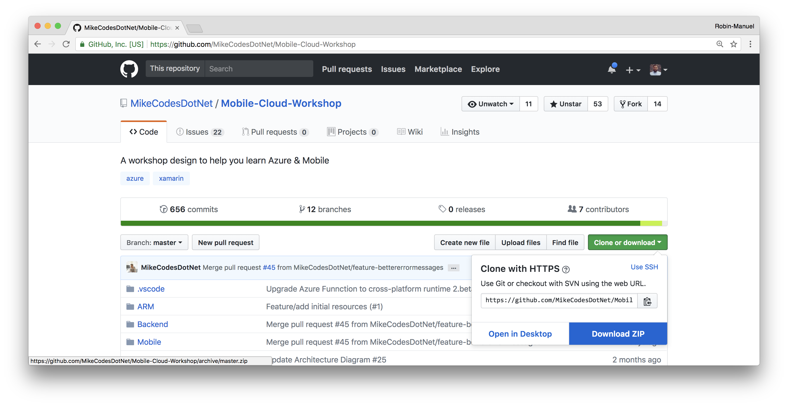
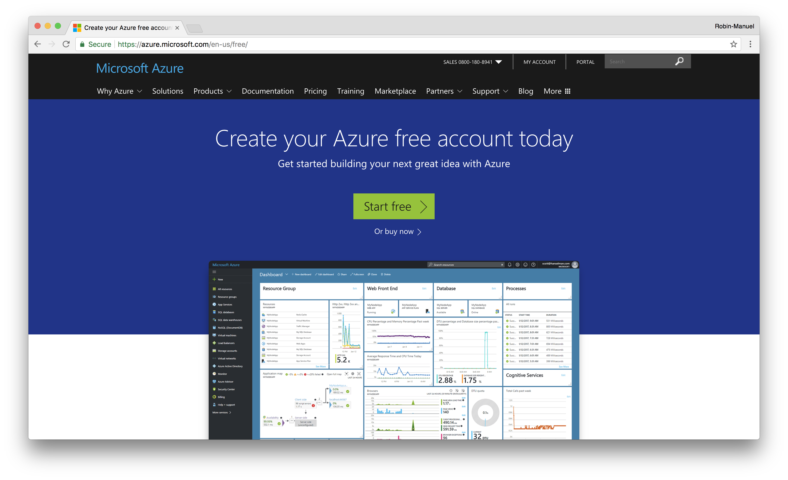
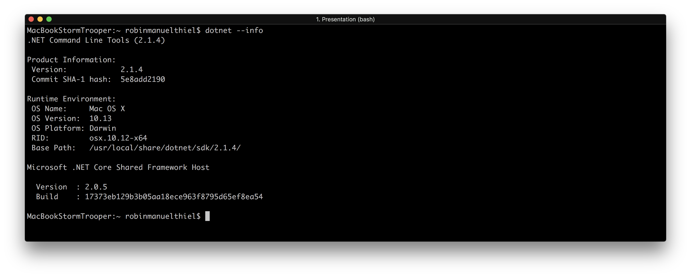
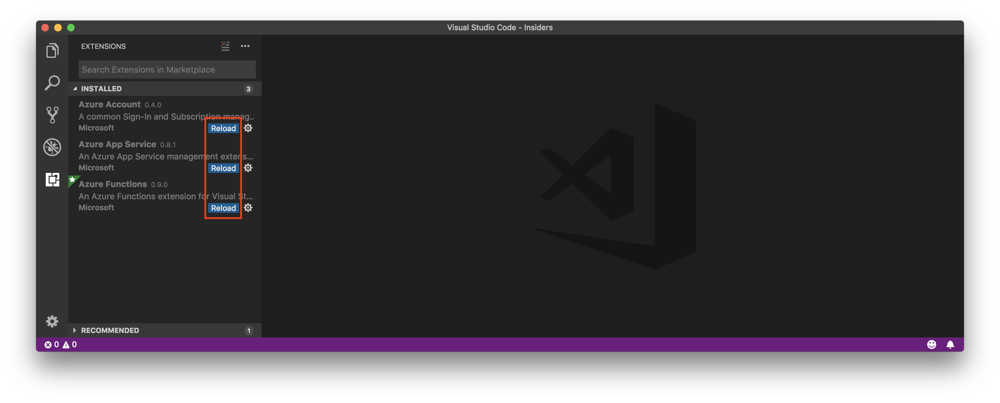

# README


## Setting Up

> **Hint:** We highly recommend you setup and configure your system _before_ attending the mobile workshop. Although we’ve allowed an hour in the morning to assist in trouble shooting configurations, we won’t have time to do a fresh installation.

### Prerequisites

Please bring your own **Windows or Mac** laptop. To participate in this workshop, some prework needs to be done. So please make sure you prepared your environment bringing the following prerequisites.

#### Mandatory

* [Microsoft Azure Account with a Subscription](https://aka.ms/azft-mobile)
* [Visual Studio Code](https://code.visualstudio.com/)
  * [Azure App Service Extension](https://marketplace.visualstudio.com/items?itemName=ms-azuretools.vscode-azureappservice)
  * [Azure Functions Extension](https://marketplace.visualstudio.com/items?itemName=ms-azuretools.vscode-azurefunctions)
* [.NET Core SDK](https://www.microsoft.com/net/download/windows/build) \(x64 for Windows\)
* [Postman](https://www.getpostman.com/)

#### Optional

You can completely follow the workshop without compiling the Mobile App on your own, as the full content is focused on architecting and creating Backends. However, if you already are a Xamarin Developer or always wanted to get started, install the Xamarin Tooling as well.

* [Visual Studio for Windows or Mac](https://www.visualstudio.com/) \(Community Version or higher\)
  * [Xamarin Tooling](https://developer.xamarin.com/guides/cross-platform/getting_started/installation/windows/)
  * Android SDK 8.1 Oreo \(API Level 27\)
  * iOS SDK 11

### Prepare your environment

#### Download the workshop

You will need some contents of this workshop like the source code for the backeend on your local machine. So it is a good idea, to download the full repository as a ZIP file and extact it somewhere locally. You can easily do this by clicking the _**Clone or download**_ button on the start page and select _**Download ZIP**_.



#### Microsoft Azure

Creating a Microsoft Azure Account is easy! Just head over to the [Microsoft Azure for Mobile Landingpage](https://aka.ms/azft-mobile) and create a free Account. If you already have a Microsoft, Outlook, Office 365 or Active Directory Account from you company, you can re-use it.



Although the free Account includes a bunch of services that you can use, in this workshop we will work with advanced resources, which we need an Azure Subscription for. An Azure Subscriptuon is basically the way to pay for charged services and can be backed by a Credit Card or a company agreement.

You can check the Subscriptions for you account when visiting the [Azure Portal](https://portal.azure.com) and selecting _**Subscriptions**_ from the side menu.


If no Subscriptions appear, visit the [Azure Subscription Portal](https://account.azure.com/Subscriptions) to add one.

### Test your configuration

#### .NET Core

Most parts of this workshop are written in .NET Core 2.0 and we need to compile a few things from time to time. For this, we need to the [.NET Core SDK](https://www.microsoft.com/net/download/windows/build) installed. To check if the installation has been successful, open the _Terminal_ or _Command Prompt_ on your machine and type in

```bash
dotnet --info
```

If the command line answers you similar like shown in the screenshot below, your machine can now run and compile .NET code.



#### Visual Studio Code

Open Visual Studio Code and navigate to the _**Extensions**_ tab on the left \(or select _**View -&gt; Extensions**_ from the menu\) and make sure that you installed the **Azure App Service** and **Azure Functions** extensions at least. If you don't have them installed, you can search for them in the Extensions tab.

Note, that you need to _**Reload**_ Visual Stuido Code after installing extensions!



Once the extensions has been installed successfull and Visual Stuido Code has been reloaded, you should see a new _**Azure**_ tab on the side. Select it and make sure that you are logged in with you Azure account. Please verify, that you see at least one of your subscriptions here.


Now you are good to go! Open the recently downloaded and unzipped Workshop folder in Visual Studio Code by clicking _**File -&gt; Open...**_ in the menu and select the full folder. The result should look similar to this:


#### Mobile Development with Xamarin \(optional\)

If you want to compile the Xamarin Application on you own, you will need to install the Xamarin tooling. You don't need to have this, to follow the workshop but if you already are a Xamarin Developer or always wanted to get started, give it a go! The setup of a Xamarin development environment can get a little bit tricky and time consuming as it has dependancies on many SDKs and technologies from different companies.

**Windows**

When working in Windows, Visual Studio will be the best IDE for you! You can check internally if you have a license for the paid versions or even go with the free Community Edition. Both will work for you.

Please [follow this guide](https://developer.xamarin.com/guides/cross-platform/getting_started/installation/windows/) to install the Xamarin Tooling for Visual Studio on Windows and make sure, you have at least Android API Level 16 and an Android Emulator installed.

When working on Windows, you won't be able to build iOS solutions unless you connect your machine with a Mac in your network. To follow this workshop, an iOS configuration is not mandatory! [Follow this guide](https://developer.xamarin.com/guides/ios/getting_started/installation/windows/) if you want to connect to a Mac Build Host anyway.

**Mac**

When using a Mac, the best Xamarin Tooling provides Visual Studio for Mac. Xamarin should be installed during the installation of Visual Studio. Please [follow this guide](https://docs.microsoft.com/en-us/visualstudio/mac/installation) to make sure you don't miss anything.

If you want to build iOS solutions, make sure that XCode is also installed on the same device!

**Test your installation**

To make sure your environment works as expected and is able to compile and execute Xamarin apps, your can simply open the [`ContosoMaintenance.sln`](https://github.com/MikeCodesDotNET/Mobile-Cloud-Workshop/tree/35f9f8a6612d4432090ff39dc804ce89ffc20e36/ContosoMaintenance.sln) solution with Visual Studio and select the `ContosoFieldService.iOS` or `ContosoFieldService.Droid` project as your Startup project. If the application gets compiled and the app can be started, you are good to go.


